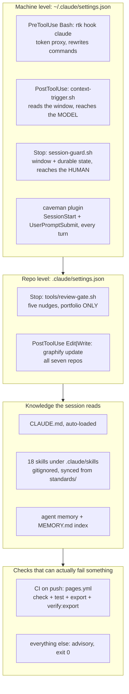
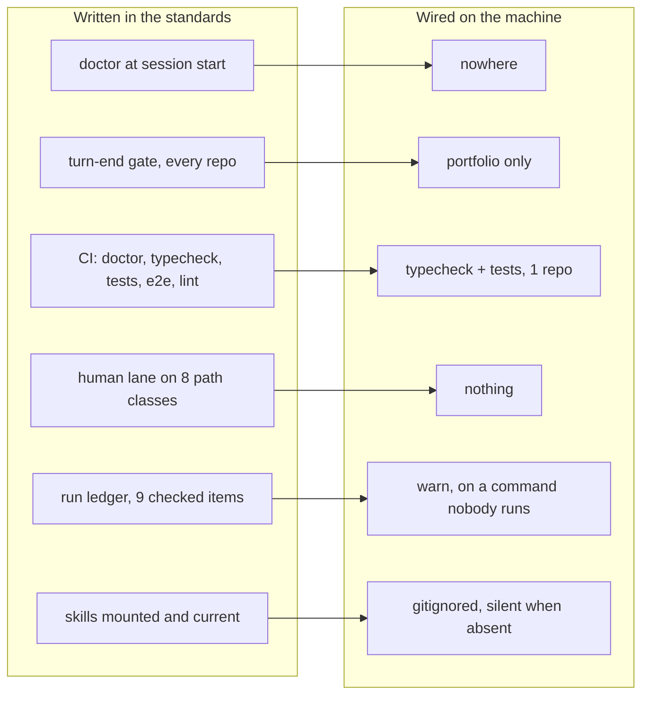

# Audit: how the AI loop actually runs, 2026-08-13

A read-only pass over the machinery that governs an AI session in this estate: the hooks, the gates,
the standards, the evidence trail, the handoff. It answers one question. When nobody is watching a
session, what is actually holding it to the contract, and what is only being remembered?

The trigger was Addy Osmani's [Agentic Code Quality](https://addyo.substack.com/p/agentic-code-quality),
so the first section reads that against what is already built here. The rest is the audit.

Nothing was fixed. Every finding cites a file, a line, or a command whose output is quoted.

> **Status, same day.** The findings below are the snapshot the pass produced and are left as written,
> because an audit edited to match what happened afterwards stops being evidence of anything. Three of
> the recommendations were then built in the same session: the loop manifest, the doctor's hook-drift
> check, and the move of the turn-end gate up to the machine level. F1, F4, F5, F6, F7, F8, F11 and
> F12 are untouched. What changed and what it cost is in
> [`artifacts/runs/2026-08-13-loop-audit-and-machine-mount.md`](../artifacts/runs/2026-08-13-loop-audit-and-machine-mount.md).

---

## 1. What the article says, and where it lands here

Osmani's thesis is one sentence. Software quality now depends on the constraints you set around your
agents, because human code review does not scale to machine-speed output. Quality stops being a
review activity and becomes a systems design problem: build the verification harness, then let the
agents run inside it.

He places constraints at three points, and this is the useful part of the piece:

1. **Pre-work.** Shape the task before the agent starts.
2. **Real time.** Feedback while the agent is working, with hooks that pull in a human or another
   agent when a check goes red.
3. **The production boundary.** What decides whether a change is allowed out.

He also names the quality signals a harness should carry: unit, property and acceptance tests,
mutation testing to prove the tests actually catch bugs, cyclomatic complexity, architecture rules
enforced in the linter, security scanning, and back-pressure, meaning a way to slow agent output
down when verification capacity is the bottleneck rather than lowering the bar.

**This estate is already ahead of him on process and behind him on measurement.** That is the finding
worth carrying out of the read, and it is not close.

LOOP section 1 already maps his earlier five primitives, and LOOP section 5 already cites him twice.
The pre-work constraint exists here as the declared envelope and the three lanes (LOOP section 4b).
The real-time constraint exists as the PostToolUse graph refresh and the context trigger. The
turn-end gate is a fourth point he does not have. The production boundary exists as the hard stops
and the human landing every merge.

What is missing is the second list. Across the whole estate there is no coverage number, no mutation
testing, no complexity ceiling, no architecture or dependency rule, and no security scan. The linter
runs correctness and style categories only (`.oxlintrc.json`). The gates here are strong at proving
that a session behaved and weak at proving that the code is any good.

That asymmetry has a cause worth naming. Every gate in this estate was written in response to a
process failure that actually happened: a session that skipped a handoff, a tour that was never
written, a lint count that crept. None of them was written in response to a quality failure, because
quality failures here have been caught by a human reading the diff. That works at one person and one
repo. It is exactly the thing the article says stops working.

---

## 2. The loop as built

Four layers, each with a different owner and a different blast radius.



### 2.1 The machine tier

Installed once, fires in every repo on the device.

| Hook | File | What it does | Can it stop anything |
|---|---|---|---|
| PreToolUse on Bash | `rtk hook claude` | Rewrites shell commands through the token proxy | No |
| PostToolUse, all tools | `~/.claude/tools/context-trigger.sh` | Reads the transcript, and when the window crosses the warn line injects the reading plus the durable-state blockers into the model's context | No, but it is the only hook that reaches the model at all |
| Stop | `~/.claude/tools/session-guard.sh` | Same reading, addressed to the person, plus the three durable-state facts from `durable-state.sh` | No, exit is always 0 |
| SessionStart and UserPromptSubmit | caveman plugin | Restates the terse-output style once per session and again every turn | No |

The context trigger is the single cleverest thing in the whole system, and its header comment says
why: a Stop hook at exit 0 writes to the transcript, where the model never reads it, so the only way
to reach a running session is PostToolUse `additionalContext`. That was probed rather than assumed on
2026-08-10, from both ends. It is the mechanism the whole handoff-at-the-warn-line design rests on.

### 2.2 The repo tier

`tools/review-gate.sh` is the turn-end gate. Five nudges, in the order it runs them:

0. Typecheck, but only when a TypeScript file changed this turn. The only check in the file that
   catches an outright defect.
1. `proof verify` over the working diff, which enforces a plan's declared scope.
2. A rendered change owes a CRUMB dev tour. Narrow path regex on purpose.
3. Lint baseline and regress, oxlint plus voice-lint, graded against `tools/lint-baseline.json`.
4. A session that closed something owes a handoff, deduplicated per closed item in `.git/handoff-nudged`.

The file is 265 lines and roughly two thirds of it is comment explaining why each trigger is narrow.
That is not waste. Every one of those paragraphs records a failure mode that was measured, and the
file is the best written artifact in the estate.

### 2.3 The mechanical checker

`pantry doctor` is nineteen checks: kit compliance, staleness, doc link and symbol resolution, layer
pin drift, mounted-skill freshness, run-ledger evidence, uncommitted and unpushed age, the answer
log, and scope growth against the code graph. Run against this repo today:

```
19 checks, 0 failing, 4 due
[warn] graphify freshness: merged-graph.json predates this repo's own extraction
[warn] layer pins current: 1 behind: grain 0.1.21<0.1.22
[warn] skills mounted: 1 stale (loop-standard)
[warn] run ledger: 3 of 5 run reports missing evidence
```

It is a genuinely good tool. Finding F1 below is that nothing runs it.

### 2.4 The evidence trail

`plans/` for the board, `artifacts/runs/` for run reports, `artifacts/reviews/` for captured review
walks, `content/tours/` for CRUMB dev tours, and the answer log for decisions. Fifteen answers, all
acted on, which is the one part of the contract with a clean record.

---

## 3. Findings

Severity: **high** means a stated rule has no mechanism at all, **medium** means the mechanism exists
but does not reach, **low** means it works and could be sharper.

### F1. The doctor never runs by itself, anywhere. High.

LOOP section 2 states it plainly: session start runs the doctor, and its findings land in triage
before the session touches code. CONFORMANCE check C6 lists it first among the six things that must
be wired rather than remembered.

A grep across every `.claude/settings.json` and every workflow file in all seven repos returns
nothing for `doctor`. No SessionStart hook runs it. No CI job runs it. No CLAUDE.md names it as an
orientation step. The entire mechanical surface tier of the loop fires only when a person types the
command, which on a long enough timeline means it fires when someone is already suspicious.

This is the estate's own hardening ladder at rung 2 for the check whose whole purpose is to be
rung 3.

### F2. The turn-end gate exists in one repo out of seven. High.

Only `tjakoen.github.io/.claude/settings.json` carries a Stop hook. `batch`, `grain`, `pantry`,
`bread`, `project` and `greenroom` carry the graphify PostToolUse line and nothing else, and `bread`
also prints its plan board at session start.

So the tour nudge, the proof scope check, the lint ratchet and the handoff nudge do not exist for
six of the seven. LOOP's opening line is "one AI workflow across every repo". Today it is one
workflow in one repo and a graph refresher in the others. This is the single biggest obstacle to the
extensibility question, and it is also the easiest to fix, because the gate is one file and one
settings block.

### F3. The lint ratchet is red right now, and has been absorbed silently. Medium.

Running the gate by hand:

```
lint gate: 3 lint(s) regressed against tools/lint-baseline.json:
  oxlint:unicorn(no-array-sort): baseline 14 -> now 23 (+9)
  oxlint:eslint(no-control-regex): baseline 0 -> now 1 (+1)
  voice:emoji: baseline 72 -> now 73 (+1)
```

The baseline was regenerated on 2026-08-12. Somewhere between then and now, nine new sort flags and
a control-regex flag landed and nobody accepted them. The gate did exactly what it was designed to
do, printed the regression, and exited 0. This is the advisory design's bill arriving: a warning
nobody has to act on is a warning that accumulates. Worth noting that this is a demonstration rather
than an accusation, because the gate is doing its job. The question is whether printing is enough.

### F4. CI is thinner than the standard describes. Medium.

LOOP section 2's push row reads "the doctor + typecheck + tests + e2e + lint". The one workflow that
runs on push here, `.github/workflows/pages.yml`, runs `bun run check`, `bun test`, the analytics
pull, `bun run export` and `bun run verify:export`.

No e2e. No lint. No voice-lint. No doctor. There are 44 Playwright specs in `e2e/` and not one of
them runs on push. The standard describes a CI that does not exist, which is worse than describing a
weaker one, because CONFORMANCE C6 asks a checker to confirm "CI on push" and the answer is yes.

### F5. Three of seven repos have no CI at all. Medium.

`pantry`, `bread` and `project` have no `.github/workflows`. Pantry is the repo that implements the
loop itself and it carries a very large test suite, `doctor.test.ts` alone is 50KB. None of it runs
on push. `grain` and `batch` have publish workflows that build and publish and do not test.
`greenroom` has a real CI file.

### F6. The human lane is guarded by nothing. High.

LOOP section 4b defines a human lane with an explicit path list: `.github/**`, migrations and SQL,
auth and permission paths, secrets and credentials, billing, the version and exports fields of
package.json, deploy and infrastructure files, and deletions under `content/**`. A change touching
any of them is supposed to stop and wait for the owner.

Nothing enforces it. There is no PreToolUse matcher on Edit or Write. There is no CODEOWNERS file.
`gh api repos/:owner/:repo/branches/main/protection` returns `Branch not protected`. The one
PreToolUse hook on the machine is the token proxy.

CONFORMANCE C6 anticipates this check word for word, including the line "the agent knows not to does
not count". By its own rubric the estate's most safety-critical rule sits at rung 2.

### F7. Permissions have drifted toward always-approve. Medium.

`~/.claude/settings.json` carries 737 entries in `permissions.allow` and an empty `deny`. LOOP
section 4b names this failure mode directly: "the failure mode to watch is drift toward
always-approve, because a gate that never fires and a gate that is off look identical from inside the
run." An empty deny list next to a 737-entry allow list is that drift, measured.

The mitigating fact is that Nimbalyst judges per action rather than per session, which is why the
standard credits this harness. The allow list is a convenience layer on top of that, not a
replacement for it. Still worth a deny list with the section 4b paths in it, which costs one edit.

### F8. The run ledger is decaying and nothing blocks on it. Medium.

The doctor's own words: `3 of 5 run reports missing evidence`. Named: `2026-08-13-form-builder-demo`
has no gate-output section, does not write the unpushed count as a number, and touched two paths
outside its declared scope. `2026-08-11-status-without-a-hue` has no gate-output section.

LOOP section 9 is a nine-item checklist explicitly written to be machine-checkable, and the doctor
does check it. The gap is that its verdict is a warn on a command nobody runs (F1), so the checklist
is graded by the party that wrote the homework.

### F9. Skills are gitignored, so a fresh clone has none. Medium.

`.gitignore` excludes `.agents/`, `.claude/skills/` and `skills-lock.json`. CLAUDE.md instructs
sessions to invoke the standards as skills rather than fetch them. On a fresh clone or a new device,
`Skill(voice)` simply is not there, and nothing announces the absence. The degrade is silent, which
is the failure this estate's own contracts-must-not-fail-silently rule exists to prevent.

The doctor catches staleness where it runs, and currently reports `1 stale (loop-standard)`. It does
not catch absence on a machine where it was never run.

Worth saying that the decision to mount rather than commit is defensible: the skills are generated
from `standards/`, and committing generated files invites two sources of truth. The gap is the
missing loud failure, not the choice.

### F10. Nothing in the local loop can fail a turn. Structural, deliberate, worth restating.

Every hook in this system exits 0 by design, and each script says why in its header: a gate that
blocks over a soft signal is a gate that gets removed within the week. That reasoning is sound and it
was learned the hard way.

The consequence is still worth writing down plainly. The entire local tier is a notification system.
The only thing in the estate that can actually prevent a bad change from existing is CI on push,
which runs in four repos and tests in two. Between the model and the repository there is no
mechanical no.

This is where the article bites hardest. Osmani's harness is made of things that decline: the linter
that fails, the policy that blocks, the CI that refuses to deploy. This estate's harness is made of
things that mention.

### F11. No code-quality signal was being read. Medium, and the first draft of this finding was wrong.

**Corrected the same day, after measuring instead of counting files.** The original text claimed six
test files against sixteen source modules and no coverage measurement anywhere. Both halves were
wrong. The file count came from globbing `src/*.test.ts` and missing every test under `src/ai/`, and
the coverage claim assumed a tool would have to be installed when bun has the measurement built in.
Actually running it:

```
tjakoen.github.io   426 pass, 0 fail, 27 test files   All files  82.64% funcs  86.70% lines
pantry              636 pass, 0 fail, 23 test files   All files  96.29% funcs  92.37% lines
```

That is not a repo with no quality signal. It is a repo with a good one that nobody had ever looked
at, which is a different problem with a much cheaper fix, and it is a useful reminder that a finding
counted rather than measured is a guess wearing a number.

What genuinely is absent: mutation testing, a complexity ceiling, an architecture or import-boundary
rule, and a security or dependency scan. `.oxlintrc.json` runs the correctness, suspicious and perf
categories, which catch bugs and do not answer "is this getting harder to understand".

The thin spots the measurement does name, which counting files never would have: `src/content.ts` at
73%, `tools/analytics-pull.ts` at 25%, and pantry's `capture.ts` at 72%. `bun run coverage` now
exists in both repos so the number has a home. It is measured and not gated, per the owner's call.

`.oxlintrc.json` runs the correctness, suspicious and perf categories. Those catch bugs. They do not
answer "is this code getting harder to understand", which is the question the article says a
constraint system has to answer once humans stop reading every diff.

### F12. No AUDIT.md runbook, and the doctor treats its absence as information. Low.

AI-REPO-STANDARD asks each repo for an AUDIT.md whose every check is a command plus a pass bar. This
repo has none, and the doctor reports `[info] audit freshness: no AUDIT.md runbook in this repo`.
A missing artifact reported as info is a check that can never fail. Compare the graphify row, which
warns. The repo has run three real audits and written them to `docs/`, so the practice exists and the
runbook does not.

### F13. Back-pressure has no representation at all. Low today, high later.

The article's most novel idea: when change volume outruns verification capacity, the three options
are scale verification, slow the agents, or lower the bar, and the third happens by default unless
one of the first two is designed in. Nothing here measures the ratio. With one person and interactive
sessions that is fine. The moment more than one session runs unattended in the same repo it stops
being fine, and this estate already spawns successors automatically at the context line.

---

## 4. What is working, stated as plainly as the findings

An audit that only lists faults is the report LOOP section 4a warns about.

- **The context trigger and the handoff chain.** The measured discovery that a Stop hook cannot reach
  the model, and the PostToolUse route around it, is real engineering and it is documented in the
  file rather than in someone's memory.
- **The baseline-and-ratchet design.** Grading against a committed baseline instead of zero, accepting
  any decrease for free and refusing any increase without a deliberate flag, is a better answer to
  legacy lint debt than most teams reach.
- **The doctor.** Nineteen checks including scope growth against a real code graph and a run-ledger
  evidence parser. Nothing off the shelf does that.
- **The narrow triggers.** The tour nudge and the handoff nudge are both deliberately narrow, with the
  reasoning written down, because a gate that fires on everything gets muted. That instinct is
  correct and rare.
- **The answer log.** Fifteen decisions, all acted on. The one part of the contract with a perfect
  record.
- **The standards themselves.** Sixteen documents with a frontmatter contract, a skill-mount slug, an
  anti-rationalization line per file, and a rationalizations table in the heavy ones. The writing is
  better than the wiring, which is the whole shape of this audit.

---

## 5. The gap in one picture



The estate does not have a standards problem. The standards are unusually good. It has a wiring
problem, and the wiring problem is concentrated in three files: a SessionStart hook, a shared Stop
hook, and a CI workflow. That is the good news in this report.

---

## 6. Recommendations, ordered by what buys the most

Not applied. This document reports. Three owner calls were made on 2026-08-13 and are recorded inline
below, because a recommendation whose posture is still open reads as a menu rather than a plan.

**Tier 1, the wiring that already has its tool built.**

1. **SessionStart hook running the doctor, in every repo.** Closes F1. One settings block. The
   doctor already exists, already returns exit codes, already prints a triage-shaped report.
2. **Move `review-gate.sh` to `~/.claude/tools/` and wire the Stop hook machine-wide.** Closes F2.
   The script already guards every check on the thing that makes it applicable, so in a repo with no
   `plans/` and no TypeScript it costs one git call. This is the same move `session-guard.sh` already
   made, with the same reasoning, and the file's own header records that move.

   **Owner call: machine-wide, with a drift flag.** The objection to a machine-wide mount is not the
   mount, it is what it leaves behind. A repo that was wired locally before the move keeps its own
   copy of a hook that now lives one floor up, and two copies is the failure this estate has already
   named twice. The rule is that a move up is only finished when something can see the leftovers, so
   the doctor gains a check that reads a repo's `.claude/settings.json` against a manifest of what is
   now mounted machine-wide and warns on any local command the manifest supersedes. Section 6.1 below
   sketches it. Nothing gets moved up until the check that finds the stragglers exists.
3. **Widen `pages.yml` to run e2e and lint, and add the doctor as a job.** Closes F4. Add a minimal
   CI to `pantry`, `bread` and `project`. Closes F5.

**Tier 2, the mechanical no.**

4. **A PreToolUse deny on the section 4b human-lane paths.** Closes F6.

   **Owner call: this is the only place anything gets teeth.** Every other gate stays advisory and
   keeps exiting 0. The reasoning holds in both directions at once: blocking on a soft signal is how
   a gate gets deleted, and the human-lane path list is not a soft signal, it is a rule LOOP already
   states as absolute. Blocking there makes the mechanism match the prose instead of adding a new
   constraint. Pair with branch protection on main and a CODEOWNERS file.
5. **A deny list in `~/.claude/settings.json`** carrying the same paths. Closes F7.

**Tier 3, the article's list.**

6. **Coverage, measured and not gated.** The owner call, and the only quality signal being taken on
   for now. Publish the number, watch it, add a floor only once it stops moving. It is also the
   cheapest way to learn where the 44 e2e specs actually reach, which is currently unknown.
7. Deferred, and deferred deliberately rather than forgotten: a complexity ceiling on the lint
   ratchet, a dependency and secret scan on push, and mutation testing on pantry alone. Each is
   written up in this document's earlier draft reasoning and each is worth revisiting once the
   coverage number exists, because a second signal is easier to argue for when the first one has
   already found something.

**Tier 4, the honest deferrals.**

8. **Back-pressure.** Nothing to build until a second unattended session exists. Worth a paragraph in
   LOOP naming the trigger that would make it real.
9. **The comprehensibility trap.** The article raises it and does not answer it. Neither does this
   document. The ten-times-zero thesis is the closest thing this estate has to an answer, and it is
   an argument rather than a mechanism.

### 6.1 The drift flag, sketched

The requirement is narrow and worth stating before it is built, because the obvious implementation is
the wrong one. Comparing a repo's hook block against the machine-wide one by equality would flag
every legitimate local hook, and this estate has one: bread prints its plan board at session start,
which is bread's business and nobody else's.

So the check is not "does this repo have hooks". It is "does this repo have a hook that something
else now owns". That needs a manifest rather than a diff:

- `~/.claude/tools/loop-manifest.json` lists each mechanism now mounted machine-wide, with the command
  pattern it superseded and the date it moved.
- A doctor check reads each repo's `.claude/settings.json` and warns for every hook command matching a
  superseded pattern, naming the manifest entry and the date, so the message says what to delete and
  why rather than that something looks unusual.
- A local hook matching nothing in the manifest is silent. That is the bread case, and it stays legal.
- The check reports the manifest itself as missing rather than assuming an empty one, since a doctor
  that cannot find its own reference file and returns clean is the silent-degrade failure this
  document already files as F9.

The cost is honest and worth writing down: the manifest is a second place where the machine-wide
mount is described, and it will drift from the actual `~/.claude/settings.json` unless something
reads both. The mitigation is that the manifest is generated from the settings file rather than typed,
which makes it a projection rather than a copy.

---

## 7. Reading this against CONFORMANCE

CONFORMANCE C6 is the check this audit is a manual run of, and it deserves to be said out loud: the
pass this estate would need to catch every finding above already exists, written down, with the right
questions in the right order. It has never been run against these repos.

That is the pattern the whole document keeps finding. The thinking is done. The wiring is not.
