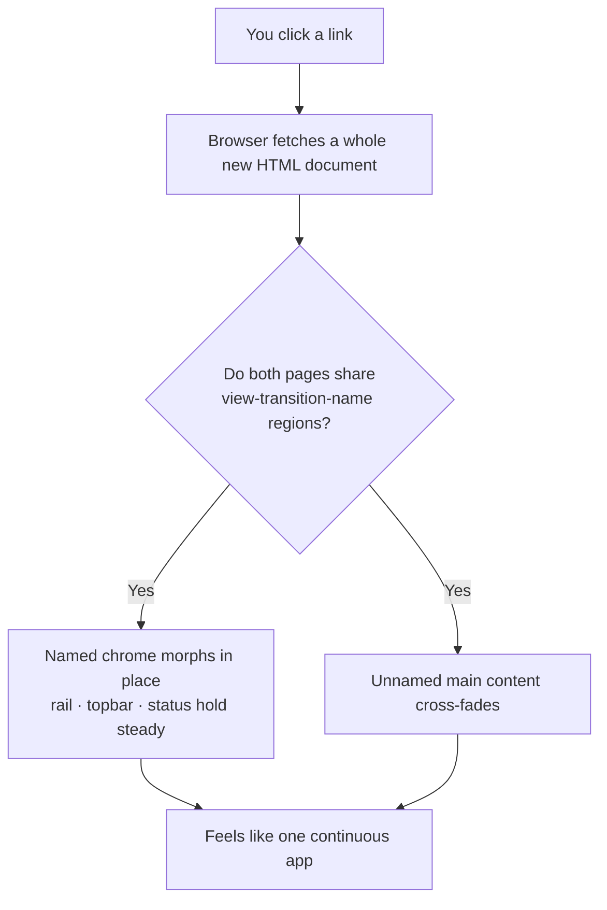
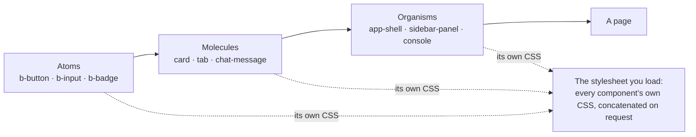
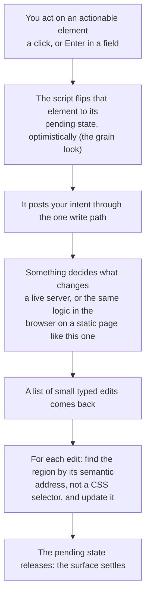

Click around this site for a minute. Change the theme, open the assistant panel, jump from a note to the showcase and back. It moves like an app: the chrome stays put, only the content changes, nothing flashes white between screens.

Now open your browser's network tab and do it again. Every one of those navigations is a full document load. A whole new HTML page, fetched from scratch, the way the web worked in 1996. There is no client-side router. There is no app shell held in memory. The page you are on gets thrown away and a new one arrives, every single time.

I want to be honest about that gap between what it feels like and what it is, because the gap is the whole trick. For years the only way to get the smooth feel was to stop doing full page loads: keep one page alive, swap the insides with JavaScript, and pay for a framework to manage the mess. I did that for a decade. This site does the opposite, and it feels the same. The reason is that the browser grew up, which is a story [I already told](the-browser-grew-up.md). This note is the part that comes after the sales pitch: the actual machinery.

## The single-page illusion is one line of CSS

Here is the trick, stated plainly. When you navigate between two pages that share the same layout, the browser can animate the difference instead of blanking the screen. It is called a cross-document View Transition. I named it in passing in the other note as one of the primitives that retired a library; this is the part I skipped there, the actual mechanism. Turning it on is genuinely one declaration:

```css
@view-transition { navigation: auto; }
```

That lives in the stylesheet every page loads. On its own it cross-fades the whole document, which is nice but not the effect I wanted. The effect I wanted is the chrome staying still while only the content moves, and that takes one more idea: you name the regions that should be treated as *the same thing* across the two pages.

```css
.app-shell__rail    { view-transition-name: shell-rail; }
.app-shell__topbar  { view-transition-name: shell-topbar; }
.app-shell__window  { view-transition-name: shell-window; }
.app-shell__status  { view-transition-name: shell-status; }
```

Because the sidebar on the old page and the sidebar on the new page carry the same name, the browser understands they are one continuous element and morphs it in place rather than fading it out and back in. Only the main content area, which has no shared name, actually cross-fades. So the rail, the top bar, the status row all hold steady while the middle swaps. That is the entire single-page feel. No router, no diffing, no virtual anything. Two full documents and a promise that these boxes are the same box.



*What actually happens on a click versus what you perceive: a fresh document every time, dressed up as a continuous surface.*

There is a small honest footnote here. Some state does survive the page swap, because it is stored in your browser rather than in server memory: which panels you have open, whether the rail is collapsed, the theme you picked. That is a few lines of localStorage, not a framework. Persisting the actual conversation with the assistant across loads is on the roadmap and not done yet, so if you reload mid-chat today, the transcript does not come back. I would rather say that than let you find out.

And if you have reduced motion turned on, the whole transition switches off and you get instant jumps, which is the correct behavior and, again, one line of CSS.

## There is no build step, and the pages are photographs

I made the full case for "no build step, and I mean it literally" in the [other note](the-browser-grew-up.md), so I will not relitigate it here. The short version: a Bun server reads my templates, expands the custom component tags I invented, and returns finished HTML, running the TypeScript directly with nothing compiled into a folder in between. The server *is* the build step, and it runs on demand.

Two details specific to how this site is put together are worth adding. First, the stylesheet you load, the one with every component's styles in it, is not a file I maintain. Each component owns its own styles, built the way [atomic design](https://atomicdesign.bradfrost.com/) teaches: small atoms compose into molecules compose into whole organisms, behavior living at the lowest layer and cascading up by inheritance rather than getting bolted on per piece. The served stylesheet is just those parts concatenated at the moment you request it. There is no bundle to keep in sync with the components, because the components *are* the bundle. (I have confessed at length about being a design-systems person to my core in [the origin story](origin-story.md); this is what that looks like in the plumbing.)



*Atomic design in the plumbing: small parts compose into big ones, and the stylesheet the browser loads is just each part's own styles concatenated on request. The components are the bundle.*

Second, and the part I find genuinely satisfying: this site is hosted as plain static files on GitHub Pages, with nothing running behind it. So where did the server go? I run it once, crawl every page it serves, and freeze the results to disk. The static site is a *projection* of the running app, not a second renderer that might drift from the first. There is exactly one thing that knows how to build a page, and the export just takes photographs of its output. One source of truth, photographed, not re-implemented.

The crawl is a single command, so the whole deploy is a GitHub Actions job. This very page reached you because, on my last push, a runner spun up the server, took the photographs, published the folder to Pages, and threw the server away. The build server existed for a few seconds inside a runner and never once for a visitor. GitHub Pages itself is not a server, it is a shelf for files, so the shape I keep coming back to holds: a server is a thing you borrow briefly to produce files, not a thing that has to stay running to hand them out.

One clarification I owe you, because "no server" is easy to overread. The stack is not anti-server; this deployment simply does not need one. The very same app boots as a live server, and that is exactly what you want the day a page needs real server things: a database, a genuine API call, data that changes per request. The static export is layered *on top of* that running server, a projection of it, never a replacement for it. So the portfolio ships as frozen files because it is only content plus a browser-side demo, while a fuller product built on this same stack keeps its server for the parts that earn one. Static is a choice this content gets to make, not a ceiling the stack imposes.

The rule under all of that is simple, and it keeps me honest about what can freeze: a page can become a static file only if it looks the same for every visitor at the moment it is built. Content passes that test easily. Data pulled from a database can pass too, as long as I bake it in once as a snapshot rather than reading it fresh per visit. Anything that genuinely changes per person or per request, a logged-in view, a live write, cannot be a photograph and stays on a server. This site happens to be all the freezable kind. A different app would draw the line in a different place, and the same stack would let it.

## The only script that earns its keep

Open the page source and count the JavaScript. There is no framework runtime. What you find instead is a small handful of plain scripts leaning on things the browser already does: a theme toggle, the sidebar collapse, the command palette wiring. The command palette itself, the one that opens on Cmd-K, is a native *dialog* element. It brings its own focus trap, its own backdrop, its own Escape-to-close. The script just tells it when to open.

The one script that is genuinely load-bearing, the one the whole design system is built around, is the door. And it is smaller than you would guess, because it only has two jobs. One: when you act on something marked as actionable, it optimistically flips that thing into its pending state and posts your intent to the single write path. Two: it listens for the edits that come back and applies each one by finding its region by *semantic* address, never by hunting for a CSS class or a tag. Send intents out; apply edits as they return. That is the entire client-side model, and, tellingly, it says nothing about a server: the script behaves identically whether a real backend decides what changes or, on this static site, the same logic runs in the browser and hands the edits straight back.



*What the one script does, start to finish: send an intent out the door, then apply the edits that come back, addressing each region by name. The script runs the same whether a server or the browser itself is what decides.*

Everything else on the page is either server-rendered HTML or a native primitive doing its native job. That is the bar the design system holds itself to, in [its own words](/grain): the browser first, a small script only when the platform truly cannot.

## One write path (and why it runs with no server)

One architectural choice is worth calling out here, because it is the same "server on demand, not by default" instinct applied to changes instead of pages. Every change to the page goes through a single write path rather than a scatter of endpoints: an interaction becomes an Intent, one component decides what happens, and the result comes back as small typed edits applied to the DOM. Reads stay plain, loaded straight from the server as HTML; only writes funnel through the one door.

The part that fits this note is what that buys the static build. The same write path can be composed to run entirely in the browser, with the edits looping straight back into the page in memory instead of over a network. So the frozen static site is not a dead snapshot: the interactive demos still work with no backend at all, because the door does not care whether there is a server behind it. Same code, once with a server, once without.

That door is also where the more interesting idea lives: a human and the AI operate the *same* controls through it, as peers, with the machine's presence shown right in the typography. But that is a whole separate thesis, and it has its own home. The readable version is in [the origin story](origin-story.md); the full argument, with the literature, is the whitepaper [One Vocabulary, Two Operators](whitepaper-one-vocabulary.md). This note is about the plumbing, not the philosophy, so I will point you across rather than repeat it.

## Three layers, stacked one direction

None of the above lives in one big pile. It is three layers, and dependency only ever flows one way.

<svg viewBox="0 0 620 290" width="100%" role="img"
     aria-label="The stack, three layers, dependency flowing one direction only. BATCH is the substrate at the bottom: a no-build server that composes HTML, runs on Bun, ships no framework. GRAIN sits on top of BATCH: the design system and the one-door AI interaction model. MILL sits on top of GRAIN: the content engine that turns Markdown into pages, and it renders this very note. Each layer depends only on the ones below it, so each can be extracted into its own project."
     style="max-width:560px;height:auto;font-family:Georgia,'Times New Roman',serif;--paper:#faf7f1;--edge:#e6ddd0;--ink:#2b2b2b;--muted:#6b6259;--bar:#cbc1b3;--accent:#d97757"
     xmlns="http://www.w3.org/2000/svg">
  <rect x="0.5" y="0.5" width="619" height="289" style="fill:var(--paper);stroke:var(--edge)"/>
  <text x="28" y="30" style="fill:var(--muted);font-size:15px">The stack: each layer builds only on the ones below</text>

  <rect x="120" y="52" width="380" height="52" style="fill:var(--paper);stroke:var(--edge);stroke-width:1"/>
  <text x="140" y="76" style="fill:var(--ink);font-size:14px">MILL</text>
  <text x="140" y="94" style="fill:var(--muted);font-size:12.5px">Markdown into pages (live: it renders this note)</text>

  <rect x="120" y="118" width="380" height="52" style="fill:var(--paper);stroke:var(--edge);stroke-width:1"/>
  <text x="140" y="142" style="fill:var(--ink);font-size:14px">GRAIN</text>
  <text x="140" y="160" style="fill:var(--muted);font-size:12.5px">The design system + the one-door AI model</text>

  <rect x="120" y="184" width="380" height="52" style="fill:var(--paper);stroke:var(--edge);stroke-width:1"/>
  <text x="140" y="208" style="fill:var(--ink);font-size:14px">BATCH</text>
  <text x="140" y="226" style="fill:var(--muted);font-size:12.5px">The substrate: no-build server, Bun, no framework</text>

  <text x="504" y="150" style="fill:var(--muted);font-size:12.5px" transform="rotate(-90 504 150)">depends downward only</text>

  <text x="28" y="270" style="fill:var(--accent);font-size:13px">One direction of dependency, so any layer lifts out into its own project.</text>
</svg>

*The stack: BATCH the substrate, GRAIN the design system on top of it, MILL the content engine on top of that. Nothing ever imports upward.*

BATCH is the substrate: the no-build server, the component tags, the static export. GRAIN sits on it and adds the design system and the one-door interaction model, importing nothing from BATCH except a single narrow port. MILL, the content engine that renders these Markdown notes into pages, sits on top of GRAIN. Because the arrows only ever point down, any layer can be lifted out and used on its own, which is the plan once each one has earned it.

Here is a small, concrete example of what "one direction, one source" buys you day to day. Every page on this site needs the same invariant head: the theme guard that runs before first paint, the stylesheets, the startup script. For a while that boilerplate risked being copy-pasted into every page template, hand-authored and MILL-rendered alike, which is exactly the kind of thing that drifts the moment you forget one. So it moved to a single place, the one spot where the layers are wired together, and gets injected once. Now no page lists it, which means no page can list it *wrong*. Small change, but it is the whole philosophy in miniature: if something must be identical everywhere, it should be written in exactly one place.

## The seam I have not closed

Time for the honest ledger, because a technical note that only lists wins is marketing.

The gap I keep flagging and keep not closing is that I have not benchmarked any of this, and I want to be careful about exactly what I do and do not know, because "is this actually faster than a framework" is the fair question and it has a more honest answer than "obviously yes."

Start with the terminology, because it is the whole answer. This is not a single-page app. It is a multi-page app, full document loads, wearing the costume of one. That distinction decides the performance question. What is categorically true, no benchmark required, is that it ships less: no framework runtime, no hydration step, no client-side router. Less to download, less to parse, less to run on the main thread. For a content site, that is a real advantage and it is checkable by reading the network tab, not by trusting my gut.

The one place a full-page-load site can *lose* to a well-built single-page app is per navigation: I refetch a whole HTML document and the browser re-parses it, where a real SPA would fetch a sliver of JSON and swap a fragment. But that gap is smaller than it sounds here, because the shell styles and scripts are cached after the first visit, so a later navigation refetches only the HTML itself, which is small and compressed, and the browser composites the transition on the GPU. So the honest claim is not "faster, full stop." It is "ships categorically less, which for this kind of site means faster, with the measured number still owed." Where a framework genuinely wins on speed is heavy client state, offline editing, drag-and-drop, big live data grids, and this site does none of that. The plan to prove the rest is the same reference app built three ways and measured by one script. When it exists, it gets linked right here.

One more honest note, since I sent the AI story across to the whitepaper: the door and the vocabulary are real and running, but the model that is supposed to drive them is not wired yet. Today it follows scripted scenarios. That is the right place to hear the caveat in full, so I will not repeat it here beyond flagging that the plumbing is further along than the mind that will eventually use it.

So that is the machinery. A stack of full page loads wearing the costume of a single-page app, composed by a server with no build step, then frozen into static files that a CDN serves in its sleep. A different way of doing things, and an old one, wearing new browser features well.

Reload the page. It will feel like an app. Now you know it is lying, and exactly how.

---

*The [judgment is human](ten-times-zero.md). The typing, by design, is not.*
