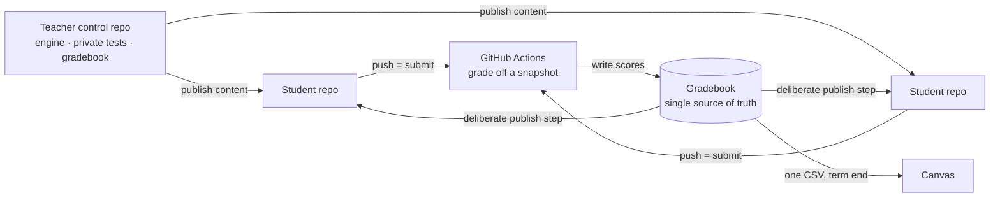

> **Draft. My voice, plain text for now.** This is the *build* story. Why I was drowning in the first
> place is [I Nearly Quit Teaching](why-i-teach.md); how I actually use AI across my teaching, with
> the receipts, is [How I Teach With AI, and Where I Lock It Out](how-i-use-ai-in-teaching.md); the
> principle under all of it is [Ten Times Zero Is Still Zero](ten-times-zero.md). The platform itself
> is public: [github-native-course-platform](https://github.com/tjakoen/github-native-course-platform).

## I built a whole platform out of pure cheapness

I did not set out to build a teaching platform. I set out to *not pay for one*, and to *not run a
server I would have to keep alive between semesters*. Everything good about the thing came out of
that constraint.

Here is what I actually had: no budget, no appetite for hosting, a school email that quietly unlocks
GitHub Education, and a room full of students who all needed to learn Git anyway. Stare at that list
long enough and the reframe writes itself. What if the repo *is* the platform? Not GitHub plus an
LMS. GitHub *as* the LMS.

So that is what it is. Coursework is a repo. Submitting is a push. Grading is a GitHub Action.
Feedback is a Markdown file that lands in the student's own repo. The only outside system that ever
shows up is Canvas, right at the end, to receive the final grades. Nothing hosted, nothing to pay
for, nothing to maintain over the summer except the content itself.

Before you ask: yes, I checked the shelf first. GitHub Classroom was the obvious fit, except it is
being sunset, so I never even got to kick the tires. I did get my hands on another tool, Classmoji,
and it was fine right up until it wasn't. It would not grade for me, and publishing content was too
rigid to bend around how I actually teach. So I stopped shopping and started building. Cheapness got
me to the idea, but the tools running out of road is what committed me to it.

## The whole design in one breath

The trick that keeps it sane is that it is one idea repeated:

- **One org per course**, locked down so a student sees only their own repos.
- **One teacher control repo** that holds the engine: the scripts, the workflows, the canonical
  grader tests I keep private, and the gradebook. The gradebook is the single source of truth. If
  it is not in the gradebook, it did not happen.
- **One workspace repo per student.** It is both their graded coursework *and* their personal
  scratch space, which is exactly why the next rule matters so much.
- **Grading and publishing are two separate steps, on purpose.** The grader clones each submission
  and scores it *off* the student's repo, against my tests, at a snapshot commit. It never writes
  back. Delivering grades and feedback is a second, deliberate step that dry-runs by default and only
  runs for work I have explicitly flagged for release.

The invariant I will not break: **the engine is identical across every course. Only the tests and a
small config file change.** Edit once, copy everywhere. That single rule is what keeps four live
classes from quietly drifting into four snowflakes I can no longer maintain.

## Building it with an AI, briefly

I built this with an AI driving the keyboard, and it says so on the front of the repo, in a badge,
not a footnote. How I actually work with one is its own post,
[Ten Times Zero Is Still Zero](ten-times-zero.md): the short version is I don't prompt and pray, I
prompt and prove, and the rails go up before the throttle goes down. What that meant *here*, on this
particular build, was two rules. The repo's own instructions tell the AI, in writing, to never touch
a student's work during grading and to flag ambiguous data instead of guessing. And anything that
writes dry-runs first, so I read the plan before it happens.

What the AI was good at was the tedious structural work: keeping that shared engine identical across
every course, and writing the very audit tools I am about to complain about needing. The parts I kept
for myself were the ones with consequences: the access model, and deciding what must never reach a
student automatically. The teaching side of all this, the feedback drafting and the one exam where I
ban the tool that built it, is [its own post too](how-i-use-ai-in-teaching.md).

## The unglamorous part was the actual work

Here is the thing nobody tells you about "just use GitHub." The interesting engineering was never the
grading. It was the plumbing around who can touch what. Every real bug I hit was a boundary bug.

**Access control is the whole ballgame.** The org has to own every repo so the engine can reach in
and grade it. But each student has to be the admin of *their own* repo and no one else's. That is a
narrow beam to thread, and getting it wrong is not a cosmetic bug. [Describe the specific access bug
that bit you here, e.g. a student who could not even see their own delivered grades. Confirm the
details before publishing.] I stopped trusting my memory of who could reach what and wrote an audit
that checks it directly, by actual collaborators on each repo, not by the names I *think* are there.

**Tokens, not titles.** Being an org admin does not let a workflow reach into other repos. The
workflow needs its own scoped token. Obvious in hindsight. A lost afternoon at the time.

**Names are data, and I kept forgetting it.** The course code in a repo's name is what the engine
filters on. A blank student config file means that student's work matches to nobody. So half my
"the grader is broken" panics were really "a repo is misnamed," which is a very different and much
more embarrassing problem. Now an audit catches the bad names before I ever run a grade, which is
roughly the moment I started trusting the system instead of babysitting it.

**Safe by default, or not at all.** Anything that writes to a student repo or the gradebook dry-runs
first and shows me the plan. I want to read what is about to happen before it happens. That one
rule has saved me more than once, and it is the reason I can let automation this close to real
grades sleep at night.

## Does it actually work?

The test I set myself was small and honest: go from an empty org to a graded hello-world for a real
student, and be able to point at every step in between and say *that works*.

That loop is now how I open every term. Lock down the org. Stand up the control repo. Get every
student a correctly named workspace. Push a unit of content and confirm it landed everywhere. Then
have them do the hello-world activity and watch it show up as a graded row in the gradebook. When
that first green row appears, the platform is confirmed end to end, and I can breathe. [Add the real
moment the first green row showed up, or a receipt you are comfortable sharing: how many courses,
how many student repos a term. No student names or numbers.]

## It is not a product, and that is the point

I am not trying to sell this. It is a teacher's tool that happens to be built like real software,
with tests and dry runs and audits, because that is the only way I trust a machine anywhere near my
students' grades. What is next is more of the boring, good kind of work: more activities graded the
same careful way, quizzes moving cleanly into Canvas, whichever audit I write the next time a repo
surprises me.

I started this because I was too cheap to pay for an LMS and too tired to run a server. I ended up
with a classroom that boots from an empty org and leaves a receipt at every step. Cheapest thing I
ever built. Best decision I made all year.

---

*The [judgment is human](ten-times-zero.md). The typing, by design, is not.*
