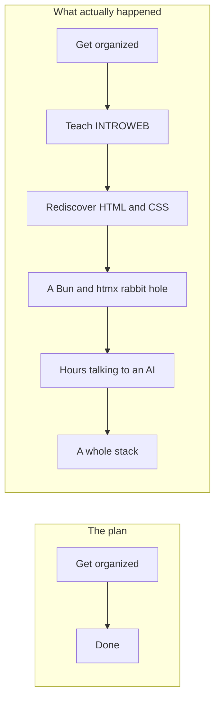
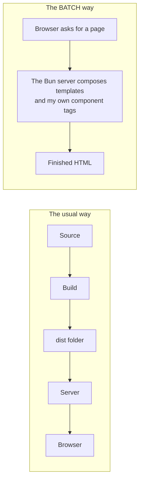
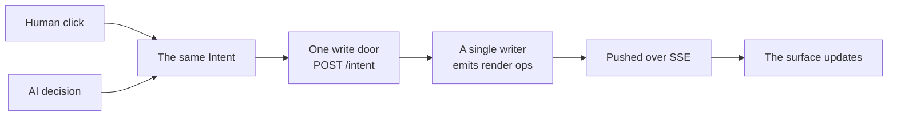
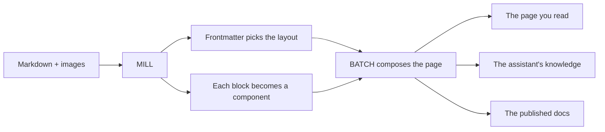

> **Draft, my own voice.** Styling and presentation come later via MILL/GRAIN; the desk figure
> awaits a real capture from the live demo. Companion to the technical docs
> ([PHILOSOPHY.md](../PHILOSOPHY.md), [ARCHITECTURE.md](../../batch/docs/ARCHITECTURE.md),
> [mill/PLAN.md](../../mill/PLAN.md)), the technical side of the native-first bet
> ([The Browser Grew Up While I Was Busy With Frameworks](the-browser-grew-up.md)), and the
> whitepaper draft [One Vocabulary, Two Operators](whitepaper-one-vocabulary.md).

## A confession, up front

I would not describe myself as a fully functional adult. I am a developer, I hold down a real job, I teach on the side, and I still cannot reliably tell you what I am supposed to be doing on Thursday. I am disorganized in a way that has outlasted every tool built to fix it.

And I tried the tools. All of them. Notion, Obsidian, Craft, Apple Reminders, the calendar, the other calendar. Each one worked for about a week, and then the same thing happened every single time: the app wanted me to become a more organized person in order to use it. It had a system, and the system was the deal. Adopt the system, and it works. I never once managed to adopt the system.

So I would bounce to the next app, learn *its* system, fall off *that* one, and go around again, collecting abandoned workspaces like a very tidy hoarder.

*The productivity-app treadmill. Every lap ends in the same place: still disorganized.*

> I wanted to stay exactly as disorganized as I am, and have the software deal with it.

## Build for the one user I understand

Here is the part that finally changed something. Recently my life got good in a quiet way: a stable job I care about, room to be passionate about the work instead of just surviving it. But good does not mean roomy. My days are already full: a full-time job as a dev manager and a team lead, plus teaching part-time to a hundred to a hundred and fifty students a semester. That is not a schedule with slack in it. It is exactly the situation a disorganized person should not be in.

Which is why I do not really have hobbies. Some people decompress with the gym, or gaming, or a five-a-side league; I do not have the hours for much of that. The little free time I do get, I spend *building*. That is my version of unwinding. So sitting in one of those rare pockets, it clicked: I had spent years trying to build things for hypothetical clients and other people. I should point that time at the one thing I actually, personally needed, and stop asking an app to reform me.

## Then a class I did not ask for lit the fuse

One of my teaching classes became INTROWEB: basic HTML and CSS. It was not supposed to be mine; it got added to my load. Happy accident. Prepping lessons, I fell down a rabbit hole (shout-out to [Coding2GO](https://www.youtube.com/@coding2go)) and realized something I had stopped believing: **modern HTML, CSS, and JavaScript are genuinely good now.**

I had lived inside frameworks for years, because when I started, the native platform really was not enough for anything serious. But I have never *liked* frameworks. They bug me the same way a productivity app does: they make you do things their way. So it turned into a dare to myself: *build this as natively as possible.* No framework, no build step, just the platform. Down that hole I met the tools that make native-first realistic today: htmx, Bun, and a lot of CSS I had underestimated. The feature-by-feature ledger of what the browser can do now is its own note: [The Browser Grew Up While I Was Busy With Frameworks](the-browser-grew-up.md).

*The plan, and the scenic route the plan actually took.*

## The real idea: an AI that manages me

Here is the thing I actually want to build. Not another place to type tasks, but an assistant whose whole job is to **manage me.** I call it the Department of Time.

Some context on why I need it. You already know the shape of my week: the job, the team, the hundred-odd students. Now stack a master's degree on top of that. Call it sixteen-hour days. I do not have a shortage of tasks; I have a shortage of the calm, organized person who is supposed to be arranging them. So I do not want a prettier list. I want something that holds the entire mess and makes the calls I would make myself, if I ever had the time.

The key inversion is this: normally *you* do the data entry. You add the task, tick the box, file the note, keep the system fed. In the Department of Time the **AI is the writer.** A human click and an AI decision become the *same action*, go through *one door*, and come back as the same visible change on screen. And crucially, the AI gets no secret back channel. It drives the exact same controls I do. When it does something, I watch it happen.

I can watch it, literally, because the AI's presence shows up as a texture in the type. When the machine writes, the ink comes out grained:

> Rebooked your afternoon, moved the thesis panel to Thursday, held the gym.

That texture is not a font bug. Grained ink means the AI did it; clean ink means a human did. The signal is never hidden. That is the whole idea.

To have an AI manage me, though, it first needed a surface to manage, something for both of us to operate, built to a no-framework, no-build standard I refused to bend on. That is where the story stops being about me and starts being about three tools I did not plan to build. Each one existed only to solve the problem the one before it created.

## BATCH: the backend that skips the build

The assistant needed a surface to drive, and my no-framework rule needed a backend that would not fight me about it. So I built **BATCH,** on one stubborn bet: there is no build step, because **the server is the build step.** It composes the final HTML on every request. Edit a file, hit refresh, done: no compiler, no toolchain, no dist folder quietly going stale while I lose twenty minutes wondering why my change did nothing.

I landed on **Bun** for a concrete reason, not the usual hype: it is the one runtime that parses HTML on the server out of the box, so I could keep inventing my own tags and still have a no-build server compose them, without dragging in a whole library to do the one thing I was trying to avoid. It runs TypeScript straight, ships its own database, and otherwise minds its business. Every choice paid down the same debt: fewer moving parts standing between me and a working page.

*No build, no dist folder: the page is composed fresh on every request.*

## GRAIN: making the machine visible

Then the thing actually had to look and behave like something, and here is a confession inside the confession: I am a design-systems person to my core. [Brad Frost's atomic design](https://atomicdesign.bradfrost.com/) is more or less my love language, I am DRY to a fault, and I would happily build fifty tiny parts before one big one. So the UI did not stay the dashboard's styles for long. It grew up into **GRAIN**, a design system built specifically around *AI interaction*, with one non-negotiable rule, the one you already met: grained ink means the machine acted, clean ink means a human did. The AI never gets to work in the dark.

Underneath the look is the part that keeps it honest. A human click and an AI decision resolve to the same intent, go through one write door, and come back as operations that redraw the surface. The AI gets no secret key I do not also hold. It plays the same piano I do, in the same room, where I can watch its hands.

> *Figure (to be captured, not drawn: a real screenshot of the live loop demo): the desk's own AI cursor moves to a Plan my day button and presses it (the same button a person would click), then writes the day out in grained ink and revises a line in place. A human click and an AI decision are the exact same action.*

*One vocabulary, one door: a human click and an AI decision are the same action all the way down.*

## MILL: because I refuse to write raw HTML

The last piece was born of pure cheapness. Once this was worth showing people, I wanted it free to host and boring to babysit: a static site on GitHub Pages, which a no-build stack can just export itself into. But static means no database, and I am not about to hand-type my own writing into HTML like it is 2004. I want to write in Markdown, drop in a couple of images, and watch the thing *become* a page.

So I built **MILL:** Markdown In, Living Layouts. Feed it Markdown and it renders real GRAIN pages out of components: frontmatter picks the layout, each block becomes a component, BATCH composes the result. The sneaky payoff is that one pile of writing does three jobs at once: it is the page you read, the knowledge the assistant can lean on, and the docs I publish. Write it once; it turns up everywhere it is needed and nowhere it is not.

*One source, many pages: write it once, and it turns up everywhere it is needed.*

## Slowing down long enough to get it right

Here is the part I am proud of, and it is not a feature. I could have rushed straight at the big app, hacked the assistant together on whatever held it up and called the mess a foundation. The younger version of me would have. Instead I noticed that the pieces underneath were worth their own care, pulled them out into real projects, and made myself finish them properly before chasing the exciting thing.

So the plan is deliberately patient. First I ship this portfolio (the modest, finishable thing) as proof that BATCH, GRAIN, and MILL actually stand on their own outside my head. Then I publish the repos publicly, so the claims are checkable and not just a story I tell. Only then do I go build the Department of Time (the assistant I needed in the first place) on foundations I already trust.

Somewhere in there I started writing the idea down properly, because it turned out to be bigger than my app. Here is the core of it, and it is nearly as old as computers themselves: a machine should *amplify* the person using it, not quietly replace them. Almost all of today's AI is built to take the task off your plate and do it somewhere offstage, out of sight. I want the opposite: an AI that works right beside you, on the very same controls, in full view. A power tool, not a stand-in. That rests on three plain commitments: the human and the AI share one set of actions, so the AI can do nothing you could not do yourself; everything it does passes through one door onto the same screen you are already watching, so it can never act behind your back; and its work is written in a different grade of ink, so you can always tell its hand from yours. Give someone a collaborator like that (visible, accountable, on equal footing) and they get help without ever handing over the wheel.

I try to be honest about what I have *not* earned yet. That this genuinely makes a person more capable is still something I have to prove, not something I have proven. It needs real studies with real people, and I say so plainly. If it holds up, I would love for this to grow from a stubborn opinion into an actual research paper. For now it is an honest argument with its homework listed at the bottom.

## The thing I am actually building

No to-do app would have me. So I stopped trying to become the kind of person that software wanted, and started building software shaped like the person I already am.

The assistant that manages me does not fully exist yet, not the real one. But the workshop I had to build to make it possible turned into three tools I am proud enough to put my name on, and a small argument about how people and machines might share a screen as equals. I am shipping those first, in the open, on purpose. Then I am going back to finish the thing I needed all along.

And this time I will be organized enough to see it through, because, eventually, that will not be my job anymore. It will be the desk's.

> Noted. I'll take it from here.

---

*With thanks to [Coding2GO](https://www.youtube.com/@coding2go), for reminding me the web platform grew up while I was not looking, and [Brad Frost](https://atomicdesign.bradfrost.com/), whose atomic design is the shape GRAIN is built in.*

*The [judgment is human](ten-times-zero.md). The typing, by design, is not.*
