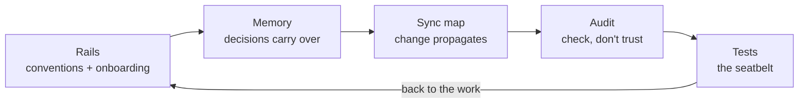
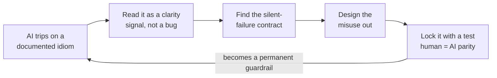

> **Draft: my voice, plain text for now.** Figures and styling come later via MILL/GRAIN. This is
> the post my repo footers point at, the one honest answer to "you let an AI write this?" Companion
> to [my origin story](origin-story.md), and to the teaching side of the same idea:
> [How I Teach With AI, and Where I Lock It Out](how-i-use-ai-in-teaching.md) and
> [I Nearly Quit Teaching](why-i-teach.md). All numbers are a snapshot of the
> [batch-stack](../../README.md) repo at the time of writing.

> **One of my students?** If what you actually want to know is how I feel about *you* using AI, I
> wrote that post for you: [How I Teach With AI, and Where I Lock It Out](how-i-use-ai-in-teaching.md).
> Read that first; this one is the belief underneath it.

## "Vibe coder" is used as an insult

You know the tone. *Vibe coder*: someone who types a wish into a chat box, pastes whatever comes
back, and ships a house of cards they couldn't explain if you held their coffee hostage. Prompt and
pray. No tests, no idea, no receipts.

I call myself one anyway. I just add a word in front: *professional.* And because "professional" is
the kind of claim that should show up with evidence and not just vibes, I did the one thing the
label almost never does: I counted.

But before the numbers, the belief they're proving. Because the reason I'm *allowed* to let a
machine do the typing fits on a napkin.

## AI is a multiplier, not an addend

> AI doesn't *add* to what you can do. It *multiplies* it. And ten times zero is still zero.

Give a strong developer an AI and you get a frighteningly fast strong developer. Give a beginner the
same AI and you get a beginner who ships bugs faster and can't tell which ones they are. Same tool.
Wildly different results, because the tool multiplied what was already there.

That's why "just use AI" is terrible advice for a beginner, and "never use AI" is terrible advice for
a professional. The honest version is in the middle and it has an order of operations: **become worth
multiplying first.**

<svg viewBox="0 0 620 200" width="100%" role="img"
     aria-label="The multiplier. A skilled developer's small baseline times AI becomes a long bar; a beginner's near-zero baseline times the same AI stays near zero. The AI is identical in both rows; the baseline is the variable."
     style="max-width:560px;height:auto;font-family:Georgia,'Times New Roman',serif;--paper:#faf7f1;--edge:#e6ddd0;--ink:#2b2b2b;--muted:#6b6259;--bar:#cbc1b3;--accent:#d97757"
     xmlns="http://www.w3.org/2000/svg">
  <rect x="0.5" y="0.5" width="619" height="199" style="fill:var(--paper);stroke:var(--edge)"/>
  <text x="28" y="30" style="fill:var(--muted);font-size:15px">The multiplier: the AI is the same, you are not</text>
  <text x="120" y="56" style="fill:var(--muted);font-size:12.5px">what you bring</text>
  <text x="270" y="56" style="fill:var(--muted);font-size:12.5px">× the same AI =</text>
  <text x="28" y="88" style="fill:var(--ink);font-size:14px">Skilled dev</text>
  <rect x="120" y="74" width="90" height="18" style="fill:var(--ink)"/>
  <rect x="270" y="74" width="270" height="18" style="fill:var(--ink)"/>
  <text x="548" y="88" style="fill:var(--muted);font-size:12.5px">a lot, fast</text>
  <text x="28" y="132" style="fill:var(--ink);font-size:14px">Beginner</text>
  <rect x="120" y="118" width="10" height="18" style="fill:var(--bar)"/>
  <rect x="270" y="118" width="30" height="18" style="fill:var(--bar)"/>
  <text x="308" y="132" style="fill:var(--muted);font-size:12.5px">still almost nothing</text>
  <text x="28" y="182" style="fill:var(--accent);font-size:13px">Same AI both rows. You are the variable.</text>
</svg>

*The AI multiplied by the same amount both times. The beginner's result is smaller than the skilled dev's starting point.*

## I was the zero, for years

Here's the part I don't usually lead with. For most of my twenties I was a talented amateur with just
enough instinct to talk my way into rooms I had no business being in. School coding came easy, so I
coasted on easy. Then I decided the real value was in business, and I kept running the same play: say
yes to running the thing before I actually knew how to run the thing.

It worked. That's the trap. It worked just enough to keep me doing it, and never enough to get me what
I was actually after. I helped grow my family's little beachside campsite into a real resort, then a
pandemic flattened it. I ran marketing for a company and learned I can't stand doing marketing for
anyone but myself. I started a cafe with friends, a salon with friends, a marketing firm on my own.
One broke even, one sold at break-even, one went nowhere, and it turns out you can't tell your friends
what to do. Then I built and launched an events platform with investors, got it to a real product with
real money moving, and watched it end badly.

Add it all up and it cost me real money and a few years I don't get back. I don't regret a peso of it,
because it finally taught me the one thing every single failure had in common. It wasn't the ideas. It
was me. I kept starting things I wasn't the right person to start yet.

> You have to be the right person before you try the thing. I paid tuition to learn that.

So I did the unglamorous thing. I stopped chasing the next launch and started working on the one
variable I could actually fix: me. I slowed down. I went back and learned the foundations properly,
deeply, not just enough to pass, and I shoved myself into the parts I was worst at, like standing in
front of a room full of students. Grind, then grind some more. That's the actual plan: work like this
now so that by my thirties the work is something I picked, on my terms. The goal was never to relax.
It was to earn the pick.

That, to me, is the definition of the word professional. Not the title. The reps.

## So we're clear who's talking

That backstory exists to buy one sentence: I could have written every line of this
project by hand. I run a team of developers for a living; on the side, I teach software engineering
part time using a [platform I built](why-i-teach.md); and the thing serving you this very sentence
is a stack I built from the ground up. Going frameworkless wasn't ignorance of the
alternatives: I lived inside frameworks for years and walked away on purpose, because [the web
platform grew up while we weren't looking](the-browser-grew-up.md) and I'd rather build on the thing
than on the thing on top of the thing.

None of that is there to impress you. It's there to place me on the multiplier at the top of this
post, because that's the whole question: what does the machine have to work with. A beginner vibe
codes because they *can't* write the code. I vibe code because I *can*, and I've learned the typing
was never the valuable part. The value is knowing what to build, how it should be shaped, and when
the machine has quietly done something dumb. I catch that last one because I've made those same
mistakes by hand, expensively, enough times to smell them coming.

So when I hand the typing to a machine, I'm not skipping the hard part. I did the hard part years ago,
the boring way and the expensive way both. That's the deal.

One gap in that list, while I'm being honest: I don't hold a single credential in AI. What I've got
instead is a thick folder of ways I've been wrong with it, which has taught me more than any syllabus
would, and I still fully intend to go earn the real thing. Chalk it up as the next foundation I
haven't laid yet.

## A decade of rehearsal, billed as management

The reframe that made me good at this faster than I had any right to be: directing an AI isn't a new
skill I had to go learn. It's the skill my whole twenties turned out to be building: the ventures
that failed, the team I run, the classroom. I'd been rehearsing for a decade. I just didn't know
what for.

Think about what a dev manager actually does: hand work to people whose hands you don't control, give
them enough context to succeed, then read what comes back and catch the problems before they ship. A
tech lead sets the conventions and keeps a room full of people pulling the same direction. An educator
explains a thing clearly enough that someone with zero context can do it, then checks their work and
corrects the *misunderstanding*, not just the wrong answer. Now describe running an AI. It's the same
list, top to bottom.

So I stopped treating the model like a magic oracle or a fancy search box, and started treating it
like what it actually resembles: a fast, capable, occasionally overconfident junior on my team, or a
student. The instant I framed it that way I got better at it overnight, because I already knew how to
do *that.*

<svg viewBox="0 0 620 250" width="100%" role="img"
     aria-label="Four titles, one skill set. A matrix of four roles (dev manager, tech lead, teacher of 120, and directing an AI) running the same moves. Give direction: a clear brief, the conventions, the lesson, a prompt with docs. Verify anyway: review the pull request, the design review, grade the work, read the output. Then all four do the same last move: correct the reasoning, not just the output. Same moves down every column; only the subject changes."
     style="max-width:560px;height:auto;font-family:Georgia,'Times New Roman',serif;--paper:#faf7f1;--edge:#e6ddd0;--ink:#2b2b2b;--muted:#6b6259;--bar:#cbc1b3;--accent:#d97757"
     xmlns="http://www.w3.org/2000/svg">
  <rect x="0.5" y="0.5" width="619" height="249" style="fill:var(--paper);stroke:var(--edge)"/>
  <text x="28" y="30" style="fill:var(--muted);font-size:15px">Four titles, one skill set</text>
  <line x1="150" y1="44" x2="150" y2="152" style="stroke:var(--edge);stroke-width:1"/>
  <line x1="261.5" y1="44" x2="261.5" y2="152" style="stroke:var(--edge);stroke-width:1"/>
  <line x1="373" y1="44" x2="373" y2="152" style="stroke:var(--edge);stroke-width:1"/>
  <line x1="484.5" y1="44" x2="484.5" y2="152" style="stroke:var(--edge);stroke-width:1"/>
  <text x="206" y="60" text-anchor="middle" style="fill:var(--muted);font-size:13px">Dev manager</text>
  <text x="317" y="60" text-anchor="middle" style="fill:var(--muted);font-size:13px">Tech lead</text>
  <text x="429" y="60" text-anchor="middle" style="fill:var(--muted);font-size:13px">Teacher (120)</text>
  <text x="540" y="60" text-anchor="middle" style="fill:var(--muted);font-size:13px">AI</text>
  <line x1="24" y1="72" x2="596" y2="72" style="stroke:var(--edge);stroke-width:1"/>
  <text x="24" y="104" style="fill:var(--ink);font-size:14px">Give direction</text>
  <text x="206" y="104" text-anchor="middle" style="fill:var(--muted);font-size:12.5px">a clear brief</text>
  <text x="317" y="104" text-anchor="middle" style="fill:var(--muted);font-size:12.5px">the conventions</text>
  <text x="429" y="104" text-anchor="middle" style="fill:var(--muted);font-size:12.5px">the lesson</text>
  <text x="540" y="104" text-anchor="middle" style="fill:var(--muted);font-size:12.5px">prompt + docs</text>
  <text x="24" y="140" style="fill:var(--ink);font-size:14px">Verify anyway</text>
  <text x="206" y="140" text-anchor="middle" style="fill:var(--muted);font-size:12.5px">review the PR</text>
  <text x="317" y="140" text-anchor="middle" style="fill:var(--muted);font-size:12.5px">design review</text>
  <text x="429" y="140" text-anchor="middle" style="fill:var(--muted);font-size:12.5px">grade the work</text>
  <text x="540" y="140" text-anchor="middle" style="fill:var(--muted);font-size:12.5px">read the output</text>
  <rect x="24" y="166" width="572" height="30" style="fill:var(--edge)"/>
  <text x="310" y="186" text-anchor="middle" style="fill:var(--ink);font-size:13px">Then all four: correct the reasoning, not just the output</text>
  <text x="28" y="232" style="fill:var(--accent);font-size:13px">Same moves down every column. Only the subject changes.</text>
</svg>

Some evenings I've got five to ten Claude sessions open at once, and it feels *exactly* like running a team:
parcel out the work, keep each one on-brief, stitch what comes back into something that hangs together.
And when I read through what they produce, it's the same muscle I use reviewing a junior's pull request
or grading a student's submission, not "is this impressive," but "do they actually understand what
they shipped, and would it survive contact with reality." My one rule for students turns out to be my
one rule for the machine: if you can't explain it, you didn't build it.

> I'm not learning a new skill with AI. I'm spending the one I already paid for.

The AI is just the newest, fastest, least-tenured member of a team I already knew how to run.

## The receipts

Everything below is pulled straight from the git history of the thing you're reading this on: my
portfolio, built on three tools I made for it. My own no-build framework (BATCH), my own design
system (GRAIN), and the little Markdown CMS that renders these very words into the page (MILL). Not a
toy, not a tutorial repo. The thing I actually build on. Fair warning: it's still in progress and not
published yet, so treat every number below as a snapshot I'll re-pull the day it ships. The ratio is
the point, and the ratio won't move.

<!-- REFRESH THESE NUMBERS (occasionally, and definitely before publishing) — the ratio + counts are a
     living git snapshot. Last measured 2026-07-03 (committed/tracked): 33 commits, 6,947 prose,
     5,411 code, 56% prose, 13,395 lines added. HOW TO RECOMPUTE, run from the repo root:
       commits:  git rev-list --count HEAD
       prose:    git ls-files '*.md' | xargs wc -l | tail -1
       code:     git ls-files '*.ts' '*.js' '*.css' '*.html' | xargs wc -l | tail -1
       prose %:  prose / (prose + code)   (6947 / (6947 + 5411) = 56.2%)
       added:    git log --numstat --pretty=tformat: | awk '{a+=$1} END{print a}'
     NOTES: "code" = ts+js+css+html, NOT TypeScript alone (TS-only is ~3,100 and would read ~69% prose,
     which is why the prose says "not code", not "not TypeScript"). Basis is COMMITTED/tracked files
     (the honest "git history" number); counting the working tree incl. uncommitted files runs higher
     (~59% prose). Scope today = the whole batch-stack monorepo; before publishing the portfolio decide
     whether to narrow to the portfolio app (batch+grain+mill + this site) or keep the full stack.
     Update in lockstep when you refresh: this SVG's bar values/labels + aria-label (bar widths are
     proportional: prose bar = 420px max, code bar = round(420 * code/prose)) and the "6,947 prose /
     5,411 code" pull-quote just above. The frontmatter subtitle/summary state the ratio WITHOUT exact
     counts on purpose (don't re-add numbers there). See CONTENT-BACKLOG.md. -->

## The one number that matters

Let me get the headline out of the way, because it reframes everything else:

> **I wrote more documentation than code.** 6,947 lines of prose against 5,411 lines of code.
> 56% of everything written in the repo is words, not code.

Sit with that for a second, because it's the exact opposite of what vibe coding is supposed to look
like. The caricature is a person who writes *no* docs, who couldn't produce a spec if you begged.
My repo has the inverse problem, if it even is one: there's *more* specification than there is
implementation.

I didn't tidy that up after the fact. It's the method. When you work with an AI at speed, the scarce
resource stops being code and becomes *intent.* The model can't know what you meant, what the rules
are, or what "done" looks like, unless you wrote it down. So I do. The documentation *is* the work;
the code is the cheap part the machine handles.

<svg viewBox="0 0 620 190" width="100%" role="img"
     aria-label="On this repo: 5,411 lines of code versus 6,947 lines of prose; 56% of everything written is words, not code."
     style="max-width:560px;height:auto;font-family:Georgia,'Times New Roman',serif;--paper:#faf7f1;--edge:#e6ddd0;--ink:#2b2b2b;--muted:#6b6259;--bar:#cbc1b3;--accent:#d97757"
     xmlns="http://www.w3.org/2000/svg">
  <rect x="0.5" y="0.5" width="619" height="189" style="fill:var(--paper);stroke:var(--edge)"/>
  <text x="28" y="36" style="fill:var(--muted);font-size:15px">What my repo actually is</text>
  <text x="28" y="86" style="fill:var(--ink);font-size:14px">Code</text>
  <rect x="96" y="72" width="327" height="20" style="fill:var(--bar)"/>
  <text x="431" y="87" style="fill:var(--muted);font-size:12.5px">5,411 lines</text>
  <text x="28" y="128" style="fill:var(--ink);font-size:14px">Prose</text>
  <rect x="96" y="114" width="420" height="20" style="fill:var(--ink)"/>
  <text x="524" y="129" style="fill:var(--ink);font-size:12.5px">6,947 lines</text>
  <text x="28" y="170" style="fill:var(--accent);font-size:13px">56% of everything written is words, not code.</text>
</svg>

## Now the "vibe" part, because I do go fast

<!-- LIVING NUMBERS (refresh occasionally, and definitely before publish): the counts below grow with
     every commit. Last measured 2026-07-03: 33 commits, the ~10h sprint (31 commits, ~1 every 20 min),
     ~13,400 lines added (13,395). HOW TO RECOMPUTE, from the repo root:
       commits:  git rev-list --count HEAD
       added:    git log --numstat --pretty=tformat: | awk '{a+=$1} END{print a}'
     The sprint window (7pm-5am, 31 commits) comes from `git log --pretty='%h %ad %s' --date=format:'%H:%M'`
     over the sprint day — eyeball the timestamps. Keep in sync with the ratio SVG + frontmatter; the
     full recompute process (prose/code/ratio) lives in the REFRESH note under "The one number that matters". -->

If the docs number makes me sound slow and fussy, the tempo says otherwise. Here's the shape of the
build:

- 33 commits, and every single one of them was co-authored with an AI. That's not the machine
  writing while I watched, I still write plenty of the code myself. Co-authored is the honest word:
  two sets of hands, on every commit.
- The core of it landed in **one overnight sprint**: 7pm to 5am, a straight ten hours, **31 commits,
  roughly one every twenty minutes.** That's vibe coding at full tilt: in flow, moving fast, the
  machine keeping up with the ideas as fast as I could aim them.
- ~13,400 lines added across six calendar days. Real output.

Both things are true at once, and that's the entire point: fast *and* documented. The reason I can
sprint for ten hours and not wake up to a pile of nonsense isn't
that I'm careful *instead* of fast. It's that I did the careful part *first*: I built the rails
before I opened the throttle.

<svg viewBox="0 0 620 160" width="100%" role="img"
     aria-label="One overnight sprint: 31 commits from 7:05pm to 5:19am, about ten hours, roughly one commit every twenty minutes. Every commit co-authored by a machine."
     style="max-width:560px;height:auto;font-family:Georgia,'Times New Roman',serif;--paper:#faf7f1;--edge:#e6ddd0;--ink:#2b2b2b;--muted:#6b6259;--bar:#cbc1b3;--accent:#d97757"
     xmlns="http://www.w3.org/2000/svg">
  <rect x="0.5" y="0.5" width="619" height="159" style="fill:var(--paper);stroke:var(--edge)"/>
  <text x="28" y="30" style="fill:var(--muted);font-size:15px">One overnight sprint</text>
  <text x="310" y="60" text-anchor="middle" style="fill:var(--ink);font-size:14px">31 commits, about one every 20 minutes</text>
  <line x1="40" y1="86" x2="580" y2="86" style="stroke:var(--edge);stroke-width:2"/>
  <line x1="40" y1="78" x2="40" y2="94" style="stroke:var(--ink);stroke-width:1"/>
  <line x1="58" y1="78" x2="58" y2="94" style="stroke:var(--ink);stroke-width:1"/>
  <line x1="76" y1="78" x2="76" y2="94" style="stroke:var(--ink);stroke-width:1"/>
  <line x1="94" y1="78" x2="94" y2="94" style="stroke:var(--ink);stroke-width:1"/>
  <line x1="112" y1="78" x2="112" y2="94" style="stroke:var(--ink);stroke-width:1"/>
  <line x1="130" y1="78" x2="130" y2="94" style="stroke:var(--ink);stroke-width:1"/>
  <line x1="148" y1="78" x2="148" y2="94" style="stroke:var(--ink);stroke-width:1"/>
  <line x1="166" y1="78" x2="166" y2="94" style="stroke:var(--ink);stroke-width:1"/>
  <line x1="184" y1="78" x2="184" y2="94" style="stroke:var(--ink);stroke-width:1"/>
  <line x1="202" y1="78" x2="202" y2="94" style="stroke:var(--ink);stroke-width:1"/>
  <line x1="220" y1="78" x2="220" y2="94" style="stroke:var(--ink);stroke-width:1"/>
  <line x1="238" y1="78" x2="238" y2="94" style="stroke:var(--ink);stroke-width:1"/>
  <line x1="256" y1="78" x2="256" y2="94" style="stroke:var(--ink);stroke-width:1"/>
  <line x1="274" y1="78" x2="274" y2="94" style="stroke:var(--ink);stroke-width:1"/>
  <line x1="292" y1="78" x2="292" y2="94" style="stroke:var(--ink);stroke-width:1"/>
  <line x1="310" y1="78" x2="310" y2="94" style="stroke:var(--ink);stroke-width:1"/>
  <line x1="328" y1="78" x2="328" y2="94" style="stroke:var(--ink);stroke-width:1"/>
  <line x1="346" y1="78" x2="346" y2="94" style="stroke:var(--ink);stroke-width:1"/>
  <line x1="364" y1="78" x2="364" y2="94" style="stroke:var(--ink);stroke-width:1"/>
  <line x1="382" y1="78" x2="382" y2="94" style="stroke:var(--ink);stroke-width:1"/>
  <line x1="400" y1="78" x2="400" y2="94" style="stroke:var(--ink);stroke-width:1"/>
  <line x1="418" y1="78" x2="418" y2="94" style="stroke:var(--ink);stroke-width:1"/>
  <line x1="436" y1="78" x2="436" y2="94" style="stroke:var(--ink);stroke-width:1"/>
  <line x1="454" y1="78" x2="454" y2="94" style="stroke:var(--ink);stroke-width:1"/>
  <line x1="472" y1="78" x2="472" y2="94" style="stroke:var(--ink);stroke-width:1"/>
  <line x1="490" y1="78" x2="490" y2="94" style="stroke:var(--ink);stroke-width:1"/>
  <line x1="508" y1="78" x2="508" y2="94" style="stroke:var(--ink);stroke-width:1"/>
  <line x1="526" y1="78" x2="526" y2="94" style="stroke:var(--ink);stroke-width:1"/>
  <line x1="544" y1="78" x2="544" y2="94" style="stroke:var(--ink);stroke-width:1"/>
  <line x1="562" y1="78" x2="562" y2="94" style="stroke:var(--ink);stroke-width:1"/>
  <line x1="580" y1="78" x2="580" y2="94" style="stroke:var(--ink);stroke-width:1"/>
  <text x="40" y="116" style="fill:var(--muted);font-size:12.5px">7:05pm</text>
  <text x="310" y="116" text-anchor="middle" style="fill:var(--muted);font-size:12.5px">about ten hours</text>
  <text x="580" y="116" text-anchor="end" style="fill:var(--muted);font-size:12.5px">5:19am</text>
  <text x="28" y="144" style="fill:var(--accent);font-size:13px">Every tick, co-authored by a machine.</text>
</svg>

## The part that actually makes it professional

The distinction that matters has nothing to do with whether you use AI or how fast you
type. **Amateur vibe coding is unstructured improvisation. Professional vibe coding is structured
delegation.** Same tools, same speed, wildly different amounts of scaffolding around the model.

And the clearest way to see it is to split the job in two:

> The AI can generate a thousand lines an hour. It cannot decide the layering rule, the token
> architecture, the single write door, or what "done" means. *Those were mine.* The machine typed;
> I engineered.

The taste, the architecture, the judgment about what's worth building and what's a trap: that's the
human. I don't make the AI reliable by writing cleverer one-off prompts. I make it reliable by
building it an environment where good work is the path of least resistance.

That environment is a system, and it's copyable.

### The playbook

**1. Write the rails before the features.** Before I built much of anything, I wrote the rulebook.
The repo has a [conventions doc](../../batch/docs/CONVENTIONS.md), the build standard: layering rules, how
components are structured, the testing bar. And an [onboarding doc](../../CLAUDE.md) written *for the
AI*, so any model (or human) joining the project reads the same "here's how this works, here's what
not to touch" before it writes a line. The AI goes fast because the guardrails are already up. You
don't tell a fast driver to be careful; you build the track.

**2. Give the AI a memory.** The model forgets everything between sessions, so I keep a running set
of decision notes, twenty-odd small records of *why* things are the way they are. We went through
the single write door because of this. The theme is decoupled because of that. Next session the AI
inherits the reasoning instead of relitigating it, or worse, quietly undoing it. A professional
keeps a paper trail. So does my repo.

**3. Make change propagate: keep a sync map.** The failure mode of fast AI work isn't bad code, it's
*drift*: you change one thing and six related things silently fall out of step. So I keep an explicit
"when you change this, also update that" table in the onboarding doc. Touch an action verb? Here are
the five places that have to move with it. It turns "don't forget" into a checklist a machine can
actually follow.

**4. Audit relentlessly. Never assume the AI knew what it was doing.** You review a junior's pull
request for a reason, and a model earns *more* of that scrutiny, not less, because it's fluent enough
to sound right exactly when it's wrong.

> Most of my prompting isn't "build this." It's "check this."

Does it still match the goal. Does it honor the docs. Did it quietly break a rule to get something
working. That's where most of the hours actually go: not building, checking. Then before the big
commits there's a [repeatable runbook](../../AUDIT.md): type-checker green? Layers still importing in
one direction only? Any hardcoded values that should be design tokens? Going fast is only safe when
there's a cheap, repeatable way to prove you didn't bend the shape of the thing.

**5. Tests are part of the work, not a phase after it.** Three tiers (unit, integration,
end-to-end) written *as* features land, not bolted on later. The type-checker and the test suite
have to be green before I call anything done. It's the least glamorous rule and it does the most
work: it's the seatbelt that lets me drive fast.

**6. Document for the machine, on purpose.** Underneath the other five is one mindset: the AI is a
first-class reader, so I write *for* it, not *around* it. It reads the same onboarding and conventions
a new teammate would. And I've started taking that down to the component level in my design system,
where the pieces the AI actually operates get a second doc written only for the machine: how to drive
the thing, not how a human reads about it. You onboard this collaborator over and over, so you build
the onboarding once and make it excellent.

*The loop is what keeps fast from turning into fragile.*

## The best trick of all: the AI's mistakes are a measurement

Here's the move I'm proudest of. While I was building one
of GRAIN's showcase pages, I kept making small mistakes: the grain texture not showing on the AI's
text, a "chat" that rendered as two stacked boxes instead of a conversation, an AI "Send" click that
didn't actually look like a click. Normal bug-fixing territory. The boring move is to squash each one
and move on.

Instead we stopped, the machine and I, and asked a better question: why do I keep tripping on my
*own* system? It's the
same reflex I use giving feedback on a code review or grading a student's project: when the same
mistake keeps coming back, you stop blaming the person making it and start suspecting the thing
they're using. When half a class flubs the same question, the problem is the question, not the class.

> If the person who designed it keeps slipping, the architecture isn't clear, and it's meant to be
> easy for a human, never mind an AI.

So the mistakes stopped being bugs and started being data.

We ran a proper review, and the mistakes weren't random. Every one clustered in a single failure mode:
silent-failure contracts. Mechanisms that quietly do nothing when you use them slightly wrong: no
error, no warning, the documented way just doesn't take. That's the most dangerous kind of design
there is, especially for a system whose whole pitch is "legible to a human and an AI." A thing that
fails loudly, you fix. A thing that fails silently, you ship.

The AI surfaced it in a way I couldn't have alone, because an AI working from your docs is the
ultimate stress-test of clarity. It has no tribal knowledge, no "oh, everyone knows you do it this
way." So when it trips on your system, that isn't the machine being dumb; it's a free audit telling
you a tired human on a Friday will trip on the exact same spot. Read the signal instead of just
correcting the output.

So we didn't document around the traps or bolt on a test to catch them later. We designed them out:
made the grade work on any element, shipped the chat as a container so messages *can't* misalign.
"Can't be done wrong" beats "we'll catch it if it is." Then we backstopped it with tests that assert
the design system is *used correctly*, not merely that the page renders, including one that proves a
human action and an AI action produce the exact same result. Those tests are executable contracts:
the next person, human or AI, gets caught the moment they misuse the thing, long after I've left the
conversation. And every fix got proven against reality: computed styles, geometry, screenshots, real
end-to-end runs, never "it probably looks right."

The one-sentence version: *where the AI keeps slipping* is a map of where my design isn't clear yet,
and I harden the design so neither of us slips there again.

## The tell is the ratio

Strip all of it down and you land right back at that first number. **56% prose.** More spec than
implementation.

An amateur and I could type the exact same request into the exact same model and get back the exact
same code. The difference isn't in that moment. It's in everything I built *around* the moment: the
conventions the model read first, the memory it inherited, the tests it has to pass, the audit it has
to survive. That surrounding structure is the profession. The code is just the code.

And it's the same law as the napkin at the top: the model multiplied what I brought. I brought
conventions, memory, tests, and taste, so it multiplied *those*.

## The point

So yes: I'm a vibe coder. I let the machine write nearly everything, I work in fast overnight bursts,
and I'll tell anyone who asks that this is the most productive I've ever been. But I can also hand you
the receipt (the commits, the ratio, the runbook) and show you it wasn't luck.

That's the whole word. *Professional.* It just means I keep the receipts. Get so good at the
fundamentals that when you finally pick up the power tool, it multiplies something real. It's the
same discipline I drill into my students from the other side of the desk, and the same rule I turn
on my own AI when it grades their work: [how I teach with AI, and where I lock it
out](how-i-use-ai-in-teaching.md).

Bring nothing and it multiplies nothing: ten times zero is still zero. So become a bigger number
first, then go make it dangerous.

> I don't prompt and pray. I prompt and prove.

---

*The judgment is human. The typing, by design, is not. On this one, nearly all of it.*
