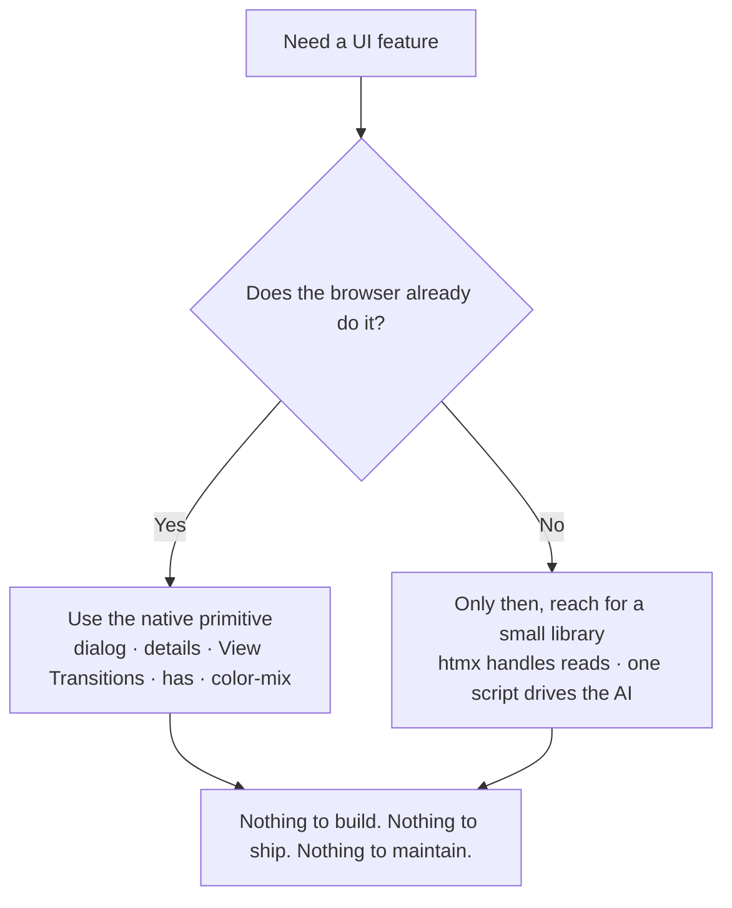
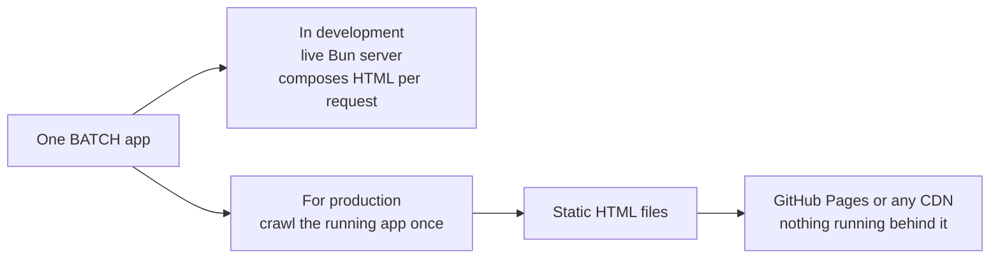
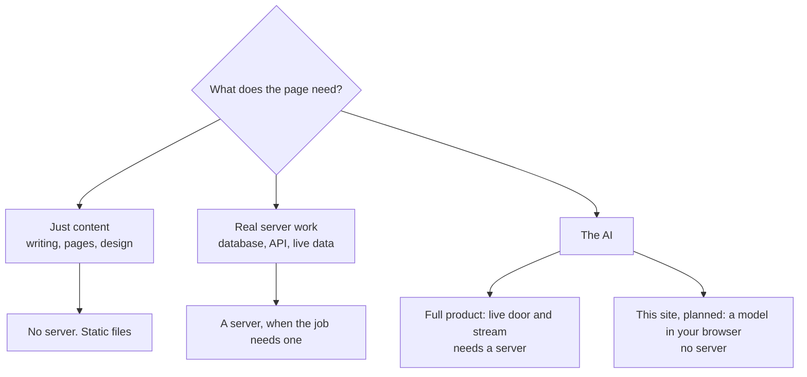

I have a graveyard of side projects, and for a long time they all died in the same place. Not at the idea. Not at the design. Somewhere around the third day, when the build config broke and I could not remember why. A framework upgrade here, a plugin that stopped talking to another plugin there, a node_modules folder heavier than the app it was supposed to serve. I would lose an evening to the machinery and never get back to the thing I actually wanted to make.

For years I told myself that was just the cost of building for the web. You pick React, you bolt on Tailwind, you pay the tax, you get a working app on the other side. I believed it because when I started, it was true. The native platform really could not do much on its own, so you rented someone else's opinions and lived inside them.

Then a class I did not ask for made me check my assumptions.

## The class that made me look again

INTROWEB, basic HTML and CSS, got added to my teaching load. Prepping it meant actually looking at the modern platform instead of assuming I still knew it, and the rabbit hole that opened up ([the origin story](origin-story.md) tells that whole tale) ended with a belief I had quietly filed away years ago: the native web is genuinely good now. This note is the part I skipped there: the actual technical *why*. What does "the platform is good enough now" mean once you get specific?

It means most of the things I used to install a library for, the browser just does.

*The native-first ladder: the browser first, a small library only when it earns it.*

## The stuff I used to reach for, and the native thing that replaced it

Feature by feature, here is where the library reflex kicked in and the browser had already beaten me to it.

**Page transitions.** I used to reach for React Router to swap screens and something like Framer Motion to animate the swap. The browser now has *View Transitions*: one line of CSS, *navigation: auto*, and same-origin navigations animate on their own. No router. No JavaScript. It falls back to an instant jump on older browsers, which is exactly what you want it to do.

**Modals.** Every project of mine used to grow a bespoke modal: a div, a backdrop, a z-index war, a scramble to trap focus and catch the Escape key. The *dialog* element does all of that natively. Focus trap, backdrop, top layer, Escape to close, for free. My command palette and my "stop the AI" confirmation are both just *dialog*.

**Dropdowns and accordions.** I once spent a genuinely embarrassing afternoon wiring up a JavaScript disclosure widget before remembering that *details* and *summary* have shipped for years. They open, they close, they are keyboard accessible, and they cost zero script.

**Tabs and navigation.** Plain links and CSS. The active tab is a server-rendered attribute, not a piece of client state I have to keep in sync with the URL. Nothing to hydrate, nothing to drift out of step.

**Behavior and theming that used to mean JavaScript or a preprocessor.** The *has* selector lets the stylesheet react to its own contents, so a whole form field can light up when the input inside it gets focus, with no script at all. *color-mix* computes a tint or an overlay right in the CSS, the sort of thing I used to spin up an SCSS pipeline and its color functions for. Add *focus-within*, *starting-style*, and text-wrap balance, and a surprising amount of what I thought was "interactivity" turns out to be CSS I did not know I already had. No Tailwind threaded through the markup either: I would rather name a semantic token once and let it cascade than repaint every element by hand.

**Forms.** Native constraint validation. Required, types, patterns, all declared in the markup. I write no validation JavaScript.

The pattern got almost funny. I would sit down to add something, reach for the library reflex, and find the feature already sitting in the browser, maintained by people far better at it than me, shipped to every user with no download.

> I kept reaching for a tool that was already in my hand.

## What "no build" actually means, and why Bun and htmx

Let me be precise about "no build step," because the phrase gets thrown around loosely. Most stacks mean a *fast* build step. I mean there is not one. No compile, no bundle, no transpile into a dist folder between the source I write and the page you get. A request comes in, the server reads my templates, expands the custom tags I invented, and hands back finished HTML. Edit a file, refresh the tab, done. I built the backend, BATCH, on exactly that bet (the fuller story is in the [origin story](origin-story.md)): the server is the build step, and it runs on demand instead of ahead of time. Nothing sits between my source and the page, which means nothing can go stale behind my back.

I should not oversell it though: "No build step" is a claim about what ships to you, not about having no tooling at all. There is still a package.json: it pins my dependencies and holds the dev tools, the Playwright tests and the TypeScript type checks, none of which ever reach a visitor. What is gone is the compiler that turns my source into a separate bundle the browser has to download. 

The one build-like moment left is optional, and funnily enough it is a production one: to host the site as static files, I run the app once and freeze its pages. That is a crawl, not a bundler.

That is also why the runtime mattered. Bun earned the job with one specific trick: it parses HTML on the server, natively. That is what lets me invent my own component tags and have the server compose them without adopting a template engine, which would have been the build step sneaking back in through the kitchen door. It runs TypeScript directly, no separate compile, and it will even hand a TypeScript file to the browser transpiled on the way out. It bundles a database too, so the day I need one it is already in the box instead of being another dependency to install. Otherwise it stays out of my way, and every part it replaces is a part I never have to babysit.

For the dynamic reads, loading a list, swapping a fragment, I use [htmx](https://htmx.org), a small JavaScript library, and it is the whole "only then, reach for a small library" branch of that diagram. htmx lets you put a couple of attributes on a plain link or form so it asks the server for a piece of HTML and slots it into the page. No client framework, no fetching JSON and rebuilding it into components. The server already speaks HTML, so htmx just lets the page ask for more of it. That is the entire client-side story for reads.

And when I do reach for a library, I am picky in one specific way: I want the one that sits closest to the platform. htmx qualifies because it leans on HTML instead of replacing it, so a page written against it still reads like a page. It also treats, in its maintainers' own words, [stability as a feature](https://htmx.org/essays/future/): they commit that htmx code written today keeps working, that even a jump across major versions should not break you, and they openly talk about powering web services that stay up for a hundred years. That is exactly what I want from a dependency, because backwards compatibility and longevity are quietly one of the biggest arguments for going native in the first place. The HTML and CSS I write today will almost certainly still work in ten years, untouched.

> The web does not break the web.

Most frameworks will not promise you that. Anyone who has limped a codebase across a major version, or watched a favorite library go unmaintained, knows the tax. The closer a dependency stays to the standards, the less of that tax I will ever pay.

If it helps to see the whole trade in one view, here is my stack next to a typical React app. Not the most optimized setup a React expert could hand-tune, just the normal one most projects actually run.

| | A typical React app | This stack |
|---|---|---|
| Build step | A bundler compiles source into a dist folder | None. The server composes HTML on each request |
| Who builds the HTML | The browser, from JavaScript (or on the server, then hydrated) | The server, once, per request |
| Client framework shipped | Yes, the React runtime plus your components | None |
| JavaScript sent to the browser | The app bundle | One script for the AI. Reads go through htmx |
| Third-party runtime dependencies | Many, the whole tree | No dependency tree. One small vendored library (htmx) on pages that need reads |
| Server and client state | A sync problem you design and maintain | Nothing to sync. The server is the source |
| Static hosting | Possible, with a build or a static-generation step | Crawl the live app and freeze it to files |
| Ten years from now | Migrations across major versions | Standards. Backwards compatible |

To be fair, React can render on the server and pre-generate pages too. The honest difference is that here those are the default, not things I add and keep configured. And the one row I left off on purpose is raw speed, because I have not run that benchmark yet. More on that below.

## The server you stop needing

Here is the part I did not fully see coming, and the bit worth sitting with. Because the output is just HTML, plus native behavior, plus one small script in one place, most of the site does not need the server at all once it exists. I run the server once, crawl every page, freeze the result to plain files, and host them on GitHub Pages for nothing. In development it is a live server. In production it is a folder of static files a CDN serves in its sleep. There is no hydration to reconcile, because there is nothing to hydrate. How that frozen folder still behaves like a live app, click for click, is its own note: [This Site Feels Like an App](feels-like-an-app.md).

*The two lives of one app: a live server while I build it, a folder of static files once it ships.*

So here is the rule of thumb I landed on:

> A server is not the price of admission for a website. It is a tool you reach for when you actually need server things.

The site you're reading this on was built static, but there is still a use case for the framework to have a server. If you have a database, an API call, or a connection to an AI endpoint, a full product built on [this stack](/grain) would genuinely need a server. BATCH is designed to work with both.

The portfolio you are reading has no server at all. The AI is headed the same way: a small language model that will run in your browser, so even the assistant becomes static files plus your own hardware. That part is still in progress and I will not pretend otherwise, but it is the thesis stated plainly. A server should be something you reach for when the job actually needs one, not the ground a website is built on by default.

*Where a server actually earns its keep. For this site, even the AI is headed for the browser.*

## So what does it actually buy me

The honest, checkable advantages first.

**Fewer moving parts I do not control.** Zero runtime dependencies, and that is not a vibe, it is in the package file. Nothing in the tree to rot, to catch a security advisory, or to break on a Tuesday because a maintainer three levels down shipped a major version.

**I own the whole surface.** The thing that always bugged me about frameworks is the same thing that bugs me about productivity apps: they make you do it their way. Vanilla means the only opinions in the code are mine, for better and for worse. Usually better. Sometimes gloriously worse, but at least they are mine.

**It is accessible and future-proof almost by accident.** A native *dialog* is accessible because the browser makers did that work already. When they improve it, my app improves too, and I ship nothing.

<svg viewBox="0 0 620 270" width="100%" role="img"
     aria-label="The replacement map. Five things I used to install, each retired by a native browser primitive: React Router plus Framer Motion by View Transitions; a modal library by the dialog element; a disclosure widget by details and summary; an SCSS pipeline by color-mix and the has selector; a form-validation library by constraint validation. Five installs down to zero."
     style="max-width:560px;height:auto;font-family:Georgia,'Times New Roman',serif;--paper:#faf7f1;--edge:#e6ddd0;--ink:#2b2b2b;--muted:#6b6259;--bar:#cbc1b3;--accent:#d97757"
     xmlns="http://www.w3.org/2000/svg">
  <rect x="0.5" y="0.5" width="619" height="269" style="fill:var(--paper);stroke:var(--edge)"/>
  <text x="28" y="30" style="fill:var(--muted);font-size:15px">The replacement map</text>
  <text x="28" y="58" style="fill:var(--muted);font-size:13px">What I used to install</text>
  <text x="340" y="58" style="fill:var(--muted);font-size:13px">The native primitive that retired it</text>
  <line x1="24" y1="68" x2="596" y2="68" style="stroke:var(--edge);stroke-width:1"/>
  <text x="28" y="94" style="fill:var(--ink);font-size:14px">React Router + Framer Motion</text>
  <text x="304" y="94" style="fill:var(--muted);font-size:14px">→</text>
  <text x="340" y="94" style="fill:var(--ink);font-size:14px">View Transitions</text>
  <text x="28" y="126" style="fill:var(--ink);font-size:14px">A modal library</text>
  <text x="304" y="126" style="fill:var(--muted);font-size:14px">→</text>
  <text x="340" y="126" style="fill:var(--ink);font-size:14px">the dialog element</text>
  <text x="28" y="158" style="fill:var(--ink);font-size:14px">A disclosure widget</text>
  <text x="304" y="158" style="fill:var(--muted);font-size:14px">→</text>
  <text x="340" y="158" style="fill:var(--ink);font-size:14px">details + summary</text>
  <text x="28" y="190" style="fill:var(--ink);font-size:14px">An SCSS pipeline</text>
  <text x="304" y="190" style="fill:var(--muted);font-size:14px">→</text>
  <text x="340" y="190" style="fill:var(--ink);font-size:14px">color-mix + the has selector</text>
  <text x="28" y="222" style="fill:var(--ink);font-size:14px">A form-validation library</text>
  <text x="304" y="222" style="fill:var(--muted);font-size:14px">→</text>
  <text x="340" y="222" style="fill:var(--ink);font-size:14px">constraint validation</text>
  <text x="28" y="254" style="fill:var(--accent);font-size:13px">Five installs, zero. The browser had already shipped all of it.</text>
</svg>

*The replacement map: every row is a dependency I no longer own.*

## The honest ledger

Now the part the framework crowd will, fairly, push on. Is it actually *faster*? My gut says obviously, less shipped is less to parse and less to run. But I have not published the benchmark, so I am not going to print a number I cannot back. The plan is real and specific: the same reference app built three ways, mine on htmx, one on Astro, one on Next, all measured by the same script, leading with the categorical facts (how much client JavaScript each ships, whether there is a build, how many dependencies) and letting the performance figures corroborate. When that exists, it gets linked right here. Until then, treat "fast because there is less" as a well-founded bet, not a proven result.

Two more edges worth owning. Native as possible is a direction, not a religion, and it never meant no JavaScript. JavaScript is part of the platform. The line I hold is no client framework, not no code, so the script I write for the AI is plain JavaScript on standard browser APIs, the Fetch call and the event stream and the DOM, as native as the HTML around it. The one genuine dependency I lean on is htmx, and I picked it because it barely leaves the platform at all. Purity for its own sake is just a different dogma wearing nicer clothes. And the trade is real: the moment you want genuinely rich client behavior, drag-and-drop, optimistic offline editing, the stuff a heavy client framework is actually great at, you are swimming against this current. I took that trade on purpose, because the apps I build do not need it. Yours might, and that is a fair reason to choose differently.

## What it cost, and what it kept

The graveyard of projects is still there. But the newest thing in it is not dead. It is shipped, and it runs on a stack thin enough that I can hold all of it in my head at once, which is the real luxury I was after the whole time.

Turns out the framework was never the thing keeping my projects alive. It was the thing quietly burying them.

> The browser grew up while I was busy learning build tools. I just had to look up long enough to notice.

---

*The [judgment is human](ten-times-zero.md). The typing, by design, is not.*
