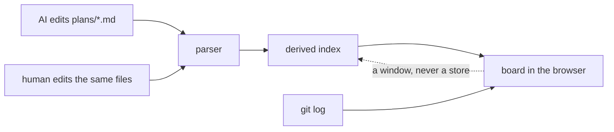

Every working session with Claude starts the same way: me asking it where we were.

Not because it's forgetful, exactly. Because the answer is smeared across a roadmap document, a
plan file per layer, a folder of memory notes, and whatever the last session's handoff prompt
happened to capture. The AI re-reads all of it, reconstructs the state of the work, and reports
back. It does this well. It also does it every single time, like a colleague who keeps his notes
in four notebooks and starts each morning by reading all four.

I should be honest about who the colleague in that sentence really is. The four notebooks are
mine. I built this workflow, one reasonable document at a time, and the AI is just the one stuck
living in it.

## The part that finally bothered me

I've been writing a design system where an AI's work is visible on the surface. Text the machine
wrote renders with a grain to it; text a human settled renders clean. The whole thesis is that you
should be able to *look* at software and see whose hand did what.

And then every morning I open a chat window and ask the machine to please describe, in prose,
what it thinks the plan is.

The output has provenance. The *intent* has none. I can watch the AI's hands on the keys, but its
plan lives wherever the last conversation left it, which is a strange place to keep the most
important artifact in the room.

> The output has provenance. The intent has none.

## Plans as files, board as projection

So here's the thing I'm building, and the shape of it is almost embarrassingly small. One plan per
markdown file, in a plans folder, with six frontmatter fields: an id, a status (todo, doing, done,
blocked), an optional track, what it depends on, what code it touches, and whose plan it is. The
body is prose and a checklist. That's the whole format.

The AI already edits markdown. It's the most native motion it has. So keeping a plan current costs
it one line: flip the status field in the file it's already working in. No plugin, no API, no new
tool for the machine to learn. The discipline rides on a motion that already exists.

Then a separate little tool reads that folder and renders it as a kanban board in the browser.
Live, over server-sent events, with the components from my own design system. The board writes
nothing. It's a window, not a database. Delete the tool and the plans are still sitting there as
readable markdown in git, which is exactly where they were all along.

I'm calling it PROOF. The stack it joins is already named batch, grain, and mill, so yes, I have
committed to the bread thing well past the point of dignity. Proofing is the stage where the dough
rises before you bake it. It's also what a plan on a wall is: proof of progress, or proof you
stalled. The pun carries more weight than most of my architecture decisions.

## The machine forgets its chores, and so do I

The obvious failure mode: the AI stops updating the files, the board quietly rots, and a stale
plan is worse than no plan, because now it lies with confidence.

Instructions alone don't fix this. A paragraph in a config file telling the AI to keep its plans
current decays the same way my own to-do lists decay, which is to say completely, by Thursday. The
fix I trust is the one that doesn't run on anyone's goodwill: hooks. The session starts, and a
script injects the current plan state into the AI's context, so it begins every conversation
looking at the wall. The session ends, and another script checks whether code changed while no
active plan was touched, and says so out loud. A lint catches a plan marked done with half its
checklist unticked. None of that requires the machine to remember anything. It requires the
machine to be watched, which is a thing I already believe about machines, and about me.

## What I have not earned yet

None of this is built. As of this writing, PROOF is a plan document and this note, which means I'm
publishing the plan for the plan tool before the plan tool exists. I'm aware of the shape of that
sentence.

And I want to be precise about who it helps, because the honest split is lopsided. The AI never
sees the board. Its benefit is real but modest: a cheaper start to each session, a ground truth
that two parallel sessions can't argue about, plans forced into pieces small enough to have a
status. Most of the value lands on me. I get to glance at a wall instead of interrogating a chat
window. If I sold this as an AI productivity tool I'd be lying about the ratio, and the ratio is
maybe seventy to thirty in my favor. I'm building it anyway, because the thirty is real and the
seventy is the part I've been missing.

If it works, the first proof will be recursive: the plan for building PROOF will be the first
thing on its own board.

And the next time a session opens, nobody has to ask where we were. The answer is on the wall,
where answers about work in progress have belonged since somebody invented the corkboard. It took
me an AI, a design system, and three bread puns to get back to that.

## Update, 2026-07-12: it's on the wall

I wrote everything above before PROOF existed. It exists now. The parser, the board, and the
check-and-init tooling all shipped, and the board streams live over server-sent events instead of
rendering a snapshot. The recursive bet a few paragraphs up paid off exactly as promised: the plan
for building PROOF was the first thing on its own board. You can read that board at
[/plans](/plans), or start at the [PROOF trailhead](/proof).

The lopsided split held too. I glance at the wall instead of interrogating a chat window, and the
machine keeps it current by flipping a status field in a file it was already editing. It has been a
while since a session opened with anyone asking where we were.

---

*The [judgment is human](ten-times-zero.md). The typing, by design, is not.*
