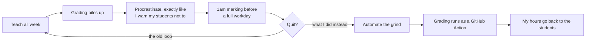

> **Draft: my voice, plain text for now.** Companion to
> [How I Teach With AI, and Where I Lock It Out](how-i-use-ai-in-teaching.md) (how the platform
> actually uses AI, with the numbers) and [Ten Times Zero Is Still Zero](ten-times-zero.md) (the
> principle underneath it). The platform this post describes is one of my highlighted projects:
> [github-native-course-platform](https://github.com/tjakoen/github-native-course-platform).

## The semester that almost ended it

Last term, I almost quit teaching. Not dramatically: no storming out, no speech. Just the quiet
math you do at 1am with a stack of ungraded submissions in front of you and a full workday starting
in seven hours.

Because here's my situation, and I'll be honest about it: I teach part-time. My day job pays well;
teaching doesn't. By the cold hourly math I should be giving this a sliver of my attention. And last semester the grading crept up on me, I procrastinated the way I always warn my
students not to, and I ended up doing frantic last-minute marking while a demanding full-time job
carried on not caring about my little scheduling crisis. It was too much. Every rational spreadsheet
said stop.

I didn't stop. I couldn't quite make myself walk away, so instead I went after the actual problem.

*The loop I was stuck in, and the exit I built instead of taking the other one.*

## First, why I teach at all

Let me get the money question out of the way, since I brought it up. I don't teach for the money.
The numbers make that almost funny. I teach because I've always loved mentoring, watching something
click for someone is a genuinely great feeling, and because standing in front of a room is the best
practice there is for confidence and public speaking, which pays off everywhere else in my career.
And yes, I'll own the less noble part too: it looks good professionally, on a resume, in a portfolio.
All three of those are real. None of them are money. That's the honest answer.

Which is exactly why this has to land. If I'm going to spend the scarce hours I have on this, the
teaching has to be *good*, not a box I tick.

## How I actually run a classroom

My students are adults, so I treat them like adults. That single decision drives most of how I teach.

- **I lean hard into self-study, because that's the job.** In the dev world, teaching yourself is not
  a fallback; it's the core skill. So I don't pretend otherwise. I hand my students every resource
  they could need, and then the learning is on them. That's not me being lazy; it's me refusing to
  lie about what the profession actually requires.
- **I spend my time on the hard parts and the code.** I'm not going to burn a session on a slide
  that asks "what is an application?" Adults can read a definition. My time (and theirs) is worth
  more than that. I go straight at the stuff that's genuinely difficult, the stuff you can't just
  look up and absorb in a minute.
- **I don't care how you get there, as long as you actually get there.** Different people learn
  differently and I'm not precious about the path. I *am* precious about the destination: you have to
  actually understand it. **If you can't explain it, you didn't build it.** That's the one line I
  come back to more than any other. (How it plays out with AI specifically is its own post:
  [How I Teach With AI, and Where I Lock It Out](how-i-use-ai-in-teaching.md).)

That's the philosophy. The problem is that a philosophy like this still buries you in grading, and
grading, done properly, is where the hours go.

## So I automated the grind, not the teaching

Here's the move I'm proud of. I could have quit, or I could have cut corners on grading and let the
quality slip. Instead I built a platform that runs an entire course on GitHub, and grades most of it
for me.

It's called the [GitHub-native course platform](https://github.com/tjakoen/github-native-course-platform),
and the whole idea is: GitHub is the LMS. Coursework is a repo. Submitting is a push. Grading is a
GitHub Action. Feedback is a Markdown file that lands in the student's own repo. The only outside
system that ever shows up is Canvas, right at the end, to receive the final grades. No hosted app, no
servers to babysit. I've run it in production across several live courses (front-end JavaScript and
React, Dart and Flutter, HTML/CSS/JS) covering hundreds of student repositories a term.

A few pieces I care about:

- **Automation only ever touches the instructor's zone.** Each student repo is both a managed course
  *and* their personal workspace, and the parts that are theirs (their notes, their journal, their
  project) are never written to. Publishing new material can't clobber a student's own work. That
  boundary was non-negotiable.
- **Grading happens off the student's repo, against canonical tests, at a snapshot commit.** Nothing
  official is read back from a place a student could tamper with. It's incremental and idempotent, so
  I can run it as often as I like and it only re-grades what changed.
- **The AI drafts feedback, but I approve every word of it.** More on that in the AI post, but the
  short version: the machine does the first pass, I make the call. Nothing reaches a student
  automatically, either. Delivering grades and feedback is its own deliberate step, separate from
  grading, and it dry-runs by default, so I get to read the plan before a single word lands in
  anyone's repo. It even flags submissions that look vibe-coded so I know where to look harder.
- **I'm honest about integrity instead of pretending.** You can't proctor take-home work. So the
  design deters the honest majority (per-student quiz variants, deadline snapshots from commit
  timestamps, viva spot-checks) and anything genuinely high-stakes happens in person. I say that out
  loud rather than selling a lie about lockdown.

## What teaching feels like now

The automation didn't make me care less. It did the opposite: it gave me back the time to care
about the right thing. Grading no longer eats my nights, so during class I mostly let students get on
with their work, and I spend my attention where it's actually useful: stepping in when something
needs real context, guiding people through the parts that are genuinely hard, having the conversation
that makes it click. The mechanical grind went to the machine. The human part came back to me.

This is my third semester now, and each term it's somewhere between a hundred and a hundred and fifty students.
A year ago that number would have buried me. Now it's fine. Not because I care less than the version
of me staring at that 1am pile, because I finally built the thing that let me care *sustainably.*

I almost quit. Instead I automated the part that was killing me, and kept the part I love. Turns out
that's a decision I get to make in code.

---

*The [judgment is human](ten-times-zero.md). The typing, by design, is not.*
